# Fast Track for Azure - Mobile DevOps - HockeyApp

- [Fast Track for Azure - Mobile DevOps - HockeyApp](#fast-track-for-azure---mobile-devops---hockeyapp)
  * [Introduction](#introduction)
  * [Pre-Requisites](#pre-requisites)
  * [Create a new Application in HockeyApp](#create-a-new-application-in-hockeyapp)
  * [Add update distribution](#add-update-distribution)
  * [Add Crash Analytics to your Application](#add-crash-analytics-to-your-application)
  * [User Metrics](#user-metrics)
  * [Add custom events](#add-custom-events)
  * [Add in-app feedback](#add-in-app-feedback)
  * [Useful References](#useful-references)

## Introduction

Managing quality across a variety of Mobile Applications is hard. During this walkthrough, we will use the Credit Card Validator Android Xamarin sample. 

The main focus of this guide is to display HockeyApp as part of a DevOps pipeline. HockeyApp enables you to distribute beta versions of your app to your users, gain insight into crash analytics, user metrics, custom events and allow feedback from within your application. 

## Pre-Requisites
* You must have access and be able to deploy into a Microsoft Azure Subscription
* You must have an active HockeyApp account.
    > If you do not yet have a HockeyApp account, you can [sign up for a free account](https://rink.hockeyapp.net/registrations/new). Once you have submitted the form, you will need to verify your e-mail address. You can find out more about [Hockey App Plans and Pricing](https://hockeyapp.net/pricing/).    
* You should have access to a Visual Studio Team Services Account. In particular, you should have access to a Team Project, where you can commit code, create and maintain Build / Release Definitions Find more information about [creating a VSTS account](https://docs.microsoft.com/en-us/vsts/accounts/create-account-msa-or-work-student).
* You should have first completed the [Xamarin Test Cloud](xamarin-test-cloud.md) section. 
    > If you have not completed the Xamarin Test Cloud section, download the [CreditCardValidatior.Droid.Zip file](https://github.com/xamarin/test-cloud-samples/raw/master/Quickstarts/downloads/CreditCardValidator.Droid.zip).
* You will require Visual Studio to add the HockeyApp nuget package to the project.

## Create a new Application in HockeyApp
1. Browse to your [HockeyApp Dashboard](https://rink.hockeyapp.net/manage/dashboard).
2. Click on the **New App** button
    > Note: You will need to have verified your e-mail address first.
3. Select **Create the app manually instead**.
4. Enter the details, as shown below:
    * **Platform:** Android
    * **Release Type:** Beta
    * **Title:** Credit Card Validator
    * **Package Name:** xamarin.example.com.creditcardvalidator

     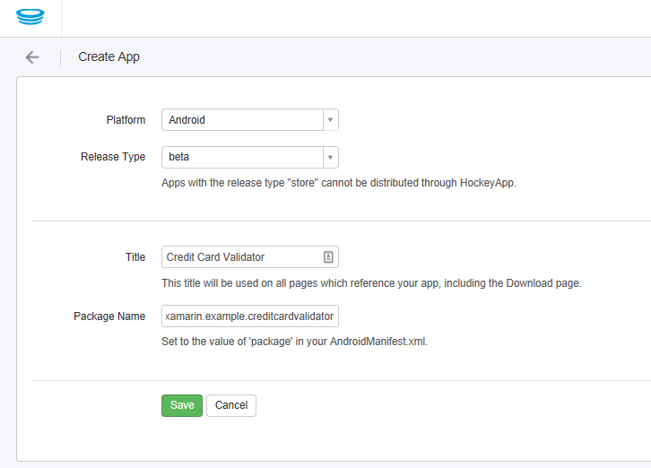

5. Click **Create**.
6. You will now be taken to a page specifically to manage your newly created application. Copy the App ID, as it will be needed later.

     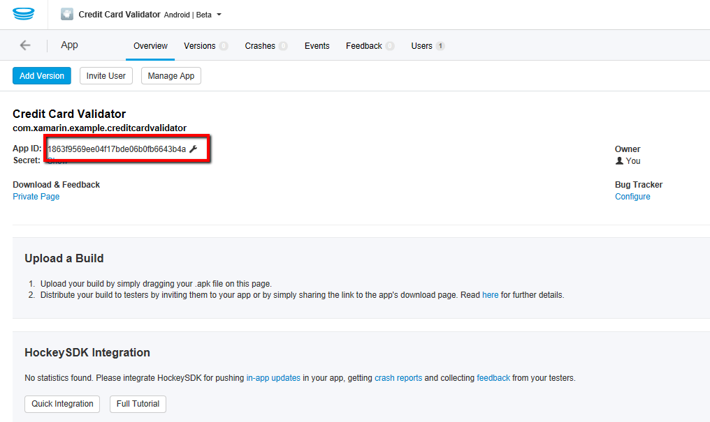

7. Navigate to the [Create API Token](https://rink.hockeyapp.net/manage/auth_tokens) section in the Account Settings of the HockeyApp dashboard.
    * **App:** You can either select **All Apps** or **Credit Card Validator**
    * **Rights:** Consider selecting **Upload & Release** to constrain priviliges
    * **Name:** Enter a display name that will make it easier to identify
    
    > Take note of the API Token, as you will need this later on in the walkthrough.
## Add update distribution
1. Open your existing **CreditCardValidator.Droid** project in Visual Studio, and Navigate to Project -> Manage Nuget Packages.
2. Search for HockeySDK.Xamarin and add it to your project.
3. Open the **MainActivity.cs** file.
    * You can do this by using an editor of your choice, such as Visual Studio or Visual Studio Code. 
        * If you opt for this approach, ensure that your changes are tracked in Git by using `git add` and `git commit`.
    * You can also edit the file and commit directly in Visual Studio Team Services for the purpose of this demo. In an enterprise environment, it would be recommended that you follow appropriate version control and branching strategies.

4. Add the following line at the top of the **MainActivity.cs** file:
    ```csharp
    using HockeyApp.Android;
    ```

5. Add the following line at the end of the **OnCreate** method:
    ```csharp
    CheckForUpdates();
    ```
6. Within your **MainActivity** class in the **MainActivity.cs file**, add the following code:
    ```csharp
    private void CheckForUpdates() {
    // Remove this for builds going to the Public Store. This step is not needed in iOS as the module automatically disables itself by default
    UpdateManager.Register(this, "YourAppID");
    }

    private void UnregisterManagers() {
    UpdateManager.Unregister();
    }

    protected override void OnPause() {
    base.OnPause();
    UnregisterManagers();
    }

    protected override void OnDestroy() {
    base.OnDestroy();
    UnregisterManagers();
    }
    ```
    > Note: Replace **YourAppID** with your App ID from the HockeyApp Portal

7. Commit and push your changes to the Git repository on your Visual Studio Team Services project. 

8. Navigate to the **Build and Release** section of your Visual Studio Team Services Team Project. 

    > You can reuse the release definition that you had created previously if you are continuing from the Xamarin Test Cloud guide.


9. Create a new environment in your Release Definition called **Beta Users** and start with an **Empty process**.

     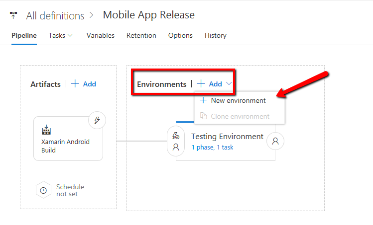

10. If you are continuing from the Xamarin Test Cloud guide, ensure that the Beta Users environment is triggered after a successful release to your Testing environment. You can configure this using the **Pre-deployment conditions** button.

     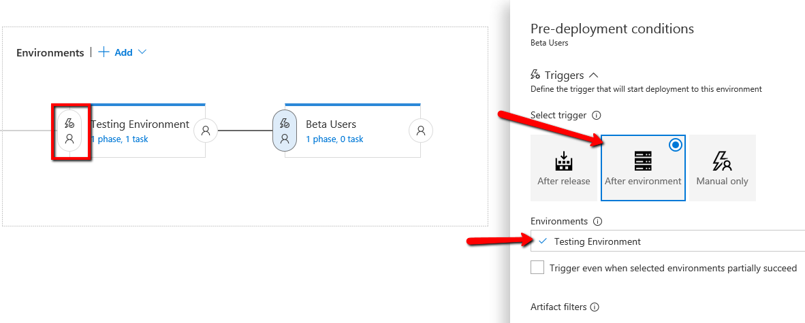

11. Add a **HockeyApp** task to the Beta Users environment.

     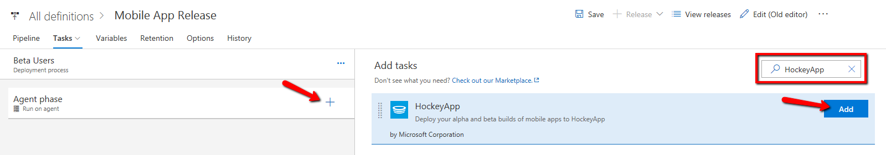

    * Create a **HockeyApp Connection** by clicking the **+ New** button.
        * **Connection Name:** Enter a name that is represenative of your HockeyApp environment and application connection.
        * **API Token:** Enter the API Token that you had set aside earlier
        * **App ID:** Enter the App ID that you had set aside earlier

12. Open the mobile app on your Android Emulator. Once the latest build has been pushed to HockeyApp, you should notice a popup prompt when you next load the mobile app.

## Add Crash Analytics to your Application
1. Open the **MainActivity.cs** file in **CreditCardValidator.Droid**
2. Add the following line at the top of your **MainActivity.cs** file:

    ```csharp
    using HockeyApp.Android;
    ```

3. Add the following lines within your MainActivity class, if it is not already there:
    ```csharp
    protected override void OnResume ()
    {
        base.OnResume();
        CrashManager.Register(this, "YourAppID");
    }
    ```
    > Note: Replace **YourAppID** with your App ID from the HockeyApp Portal

4. Open the **CreditCardValidationSuccess.cs** file.
5. At the end of the **OnCreate** class, add the following line:
    ```csharp
    throw new System.Exception("Example of HockeyApps Crash Analytics");
    ```
6. Commit and push your changes to the Git repository on your Visual Studio Team Services Team Project. 

7. If you have not yet configured Continuous Integration, then manually trigger a build of the mobile app.

8. If you have not yet configured automatic release once the build is complete, then manually trigger a release of the mobile app.

9. Once the release is complete, open the Mobile App on your android emulator. You should be prompted to update the application.

10. Enter a valid Credit Card Number (16 digits long), and allow the app to crash.

     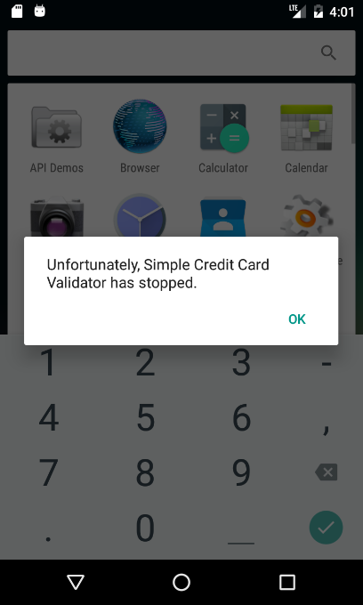

11. Reopen the app by selecting the **Enter Credit Card Number** app from the app screen. Select **Send report** when the app completes loading.

     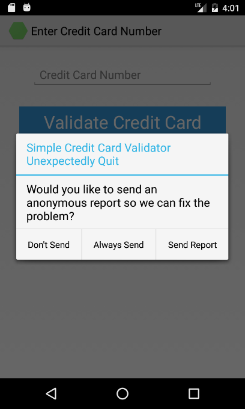

12. Navigate to your application in the [HockeyApp Dashboard](https://rink.hockeyapp.net/manage/dashboard).

     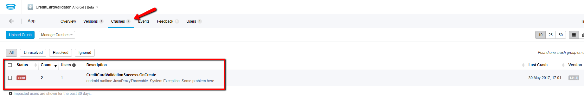

13. Select **Crashes** in the top navigation menu. You will see information appearing about the crashes in your mobile app.

14. Open the **CreditCardValidationSuccess.cs** file and comment out the line with the exception, as we are now progressing to another section.

## User Metrics
1. Open the **MainActivity.cs** file
2. Add the following line at the top of the **MainActivity.cs** file:
    ```csharp
    using HockeyApp.Android.Metrics;
    ```
3. In your OnCreate method add:
    ```csharp
    MetricsManager.Register(Application, "YourAppID");
    ```
    > Note: Replace **YourAppID** with your App ID from the HockeyApp Portal

4. If you have not yet configured Continuous Integration, then manually trigger a build of the mobile app.

5. If you have not yet configured automatic release once the build is complete, then manually trigger a release of the mobile app.

6. Open the application and perform some basic user testing.

7. Navigate to your application in your [HockeyApp Dashboard](https://rink.hockeyapp.net/manage/dashboard). Scroll down to the **User Metrics section**. You should start seeing data about your User Engagement and number of sessions from those users.

     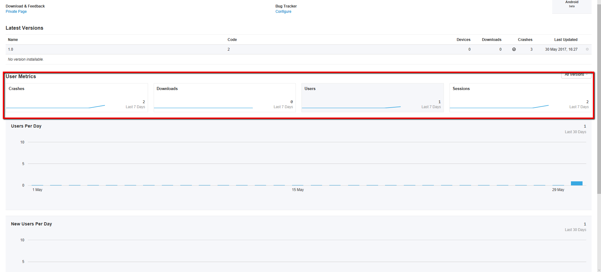

## Add custom events
1. First, ensure that you have correctly setup your **User Metrics** configuration as outlined above.
2. Open the **CreditCardValidationSuccess.cs** file.
3. At the top of the file, add the following lines:
    ```csharp
    using HockeyApp;
    using System.Collections.Generic;
    ```
4. Replace the **OnCreate** method with the following:
    ```csharp
    protected override void OnCreate(Bundle bundle)
    {
        var watch = System.Diagnostics.Stopwatch.StartNew();

        base.OnCreate(bundle);

        SetContentView(Resource.Layout.CreditCardValidationSuccess);

        watch.Stop();
        double elapsedMs = watch.ElapsedMilliseconds;

        HockeyApp.MetricsManager.TrackEvent(
        "Credit Card Validation",
        new Dictionary<string, string> { { "property", "value" } },
        new Dictionary<string, double> { { "duration", elapsedMs } }
        );

        //throw new System.Exception("Example of HockeyApps Crash Analytics");
    }
    ```
   
5. Open the application and perform some basic user testing.

6. Navigate to your application in your [HockeyApp Dashboard](https://rink.hockeyapp.net/manage/dashboard) and select the **Events** tab. You will notice telemetry appearing with respect to the custom events configured.

     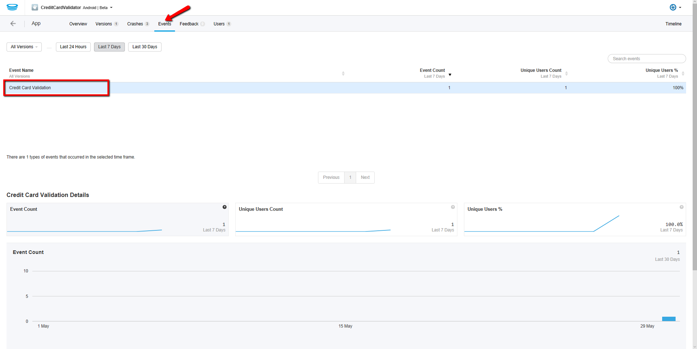

## Add in-app feedback

1. Open the **Main.Xaml** file located in CreditCardValidator.Droid/Resources/Values. 
    * Add the following code within the LinearLayout block.

    ```xml
    <Button
        android:text="@string/send_feedback"
        android:layout_width="match_parent"
        android:layout_height="wrap_content"
        android:id="@+id/sendFeedback "
        android:background="#ff0000"
        android:textColor="@android:color/white"
        android:textSize="28sp"
        android:layout_marginLeft="30dp"
        android:layout_marginRight="30dp"
        android:layout_marginTop="40dp" />
    ```

2. Open the **Strings.xaml** located in CreditCardValidator.Droid/Resources/values. 
    * Add the following snippet within the resources block.

    ```csharp
    <string name="send_feedback">Send Feedback</string>
    ```

3. Open the **MainActivity.cs** file.

4. Add the following snippet in the **MainActivity** class, near the other object instantiations.

    ```csharp
    Button _feedbackButton;
    ```

5. Add the following lines at the end of your **OnCreate** method:
    ```csharp
    FeedbackManager.Register(this, "YourAppId");

                _feedbackButton = FindViewById<Button>(Resource.Id.sendFeedback);
                _feedbackButton.Click += delegate {
                    FeedbackManager.ShowFeedbackActivity(ApplicationContext);
                };
    ```
    > Note: Replace **YourAppID** with your App ID from the HockeyApp Portal

6. If you have not yet configured Continuous Integration, then manually trigger a build of the mobile app.

7. If you have not yet configured automatic release once the build is complete, then manually trigger a release of the mobile app.

8. Open the application, and click on the Send Feedback button.

     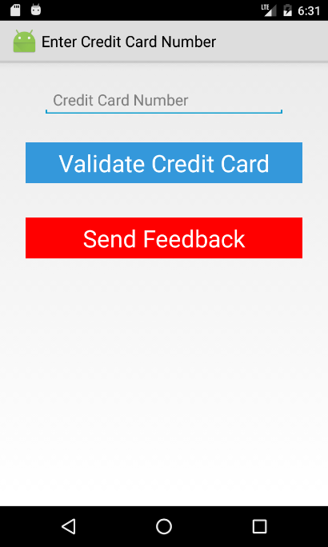

9. Submit an example set of user feedback.

     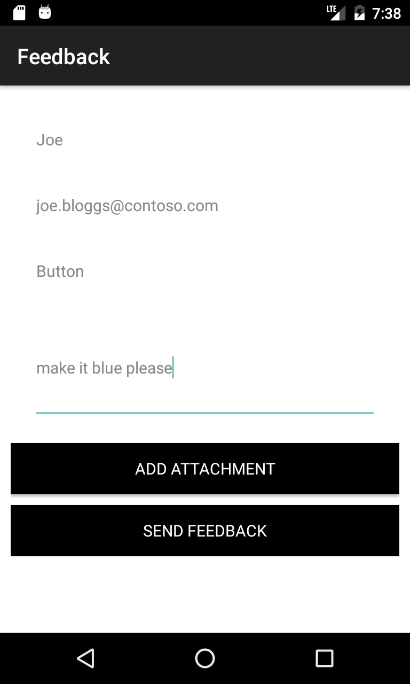

10. Navigate to your application in your [HockeyApp Dashboard](https://rink.hockeyapp.net/manage/dashboard) and select the Feedback Tab. 

     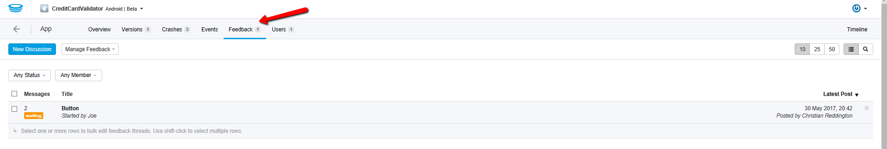

11. You will see the feedback that you submitted through the app. Click on it, to find the details.

     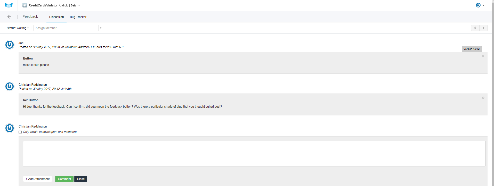

12. Provide a response, and submit a comment. Once complete, refresh the application. You will see the response from Development team. 

     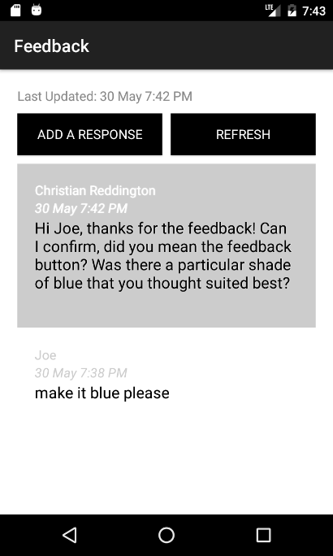

## Useful References
* [How to integrate HockeyApp with Xamarin](https://support.hockeyapp.net/kb/client-integration-cross-platform/how-to-integrate-hockeyapp-with-xamarin)
* [HockeyApp for Android (SDK)](https://support.hockeyapp.net/kb/client-integration-android/hockeyapp-for-android-sdk)
* [HockeyApp for iOS](https://support.hockeyapp.net/kb/client-integration-ios-mac-os-x-tvos/hockeyapp-for-ios)
* [How to use HockeyApp with Visual Studio Team Services (VSTS)](https://support.hockeyapp.net/kb/third-party-bug-trackers-services-and-webhooks/how-to-use-hockeyapp-with-visual-studio-team-services-vsts-or-team-foundation-server-tfs)
* [Mobile DevOps with HockeyApp and Visual Studio Team Services](https://channel9.msdn.com/Events/Build/2016/B869)