# Fast Track for Azure - Mobile DevOps

- [Fast Track for Azure - Mobile DevOps](#fast-track-for---mobile-devops)
  * [Introduction](#introduction)
  * [Pre-Requisites](#pre-requisites)
  * [Walkthrough](#walkthrough)
  * [Enhacing Your Pipeline](#enhancing-your-pipeline)
  * [Next Steps](#next-steps)
  * [References](#references)

## Introduction

Managing quality across a variety of Mobile Applications is hard. During this walkthrough, we will develop the Credit Card Validator Android Xamarin sample. 

The main focus of this guide is to leverage Xamarin Test Cloud as part of a DevOps pipeline. Xamarin Test Cloud will allow you to perform UI Tests across a range of  physical devices and view the output on the Xamarin Test Cloud dashboard.

## Pre-Requisites
* You must have access and be able to deploy into a Microsoft Azure Subscription
* You must have access to Xamarin Test Cloud. You can [sign up for a 30 day free trial](https://testcloud.xamarin.com/). You can sign up with a valid business e-mail address
* You should have access to a Visual Studio Team Services Account. In particular, you should have access to a Team Project, where you can commit code, create and maintain Build / Release Definitions Find more information about [creating a VSTS account](https://docs.microsoft.com/en-us/vsts/accounts/create-account-msa-or-work-student).
* **Optional:** Access to a Visual Studio Client (2013, 2015, 2017) and have Xamarin tools installed.
    * [Visual Studio 2013/2015](https://developer.xamarin.com/guides/android/getting_started/installation/windows/#vs2015)
    * [Visual Studio 2017](https://developer.xamarin.com/guides/android/getting_started/installation/windows/#vs2017)

## Walkthrough

1. Download the [CreditCardValidatior.Droid.Zip file](https://github.com/xamarin/test-cloud-samples/raw/master/Quickstarts/downloads/CreditCardValidator.Droid.zip). Unzip the file.

2. Using the command line, navigate into the newly created folder. 
    * Initialise the repository using the `git init` command. 
    * Track changes of the files in Git by using the `git Add .` command.
    * Commit the changes by using `git commit -m "*Enter your message here*"`
    * Push the changes to the remote Git repository on your Visual Studio Team Services Team Project. You can find the location of the repository on the **Code** tab of your Team Project.
    
    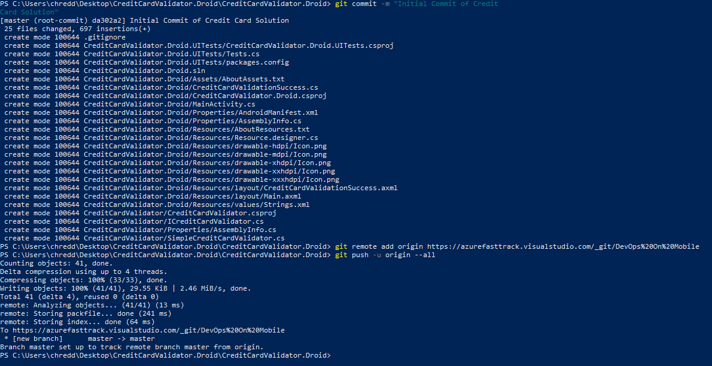

3. Navigate to the CreditCardValidator.Droid.UITests project and open the Tests.cs file.
    * You can do this by using an editor of your choice, such as Visual Studio or Visual Studio Code. 
        * If you opt for this approach, ensure that your changes are tracked in Git by using `git add` and `git commit`.
    * You can also edit the file and commit directly in Visual Studio Team Services for the purpose of this demo. In an enterprise environment, it would be recommended that you follow appropriate version control and branching strategies.
    
    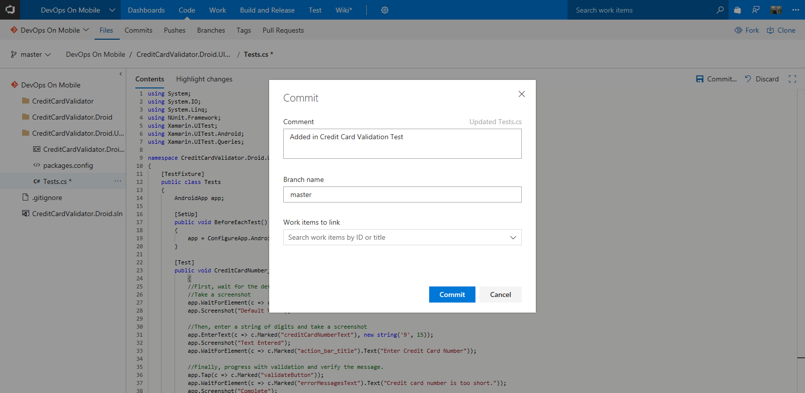

4. Add the following code Snippet into the Tests class:

    ```csharp
    [Test]
    public void CreditCardNumber_TooShort_DisplayErrorMessage()
        {
        //First, wait for the default screen and set context on the input box.
        //Take a screenshot
        app.WaitForElement(c => c.Marked("action_bar_title").Text("Enter Credit Card Number"));
        app.Screenshot("Default View");

        //Then, enter a string of digits and take a screenshot
        app.EnterText(c => c.Marked("creditCardNumberText"), new string('9', 15));
        app.Screenshot("Text Entered");
        app.WaitForElement(c => c.Marked("action_bar_title").Text("Enter Credit Card Number"));

        //Finally, progress with validation and verify the message.
        app.Tap(c => c.Marked("validateButton"));
        app.WaitForElement(c => c.Marked("errorMessagesText").Text("Credit card number is too short."));
        app.Screenshot("Complete");
    }
    ```
    The result should look similar to the below screenshot:

    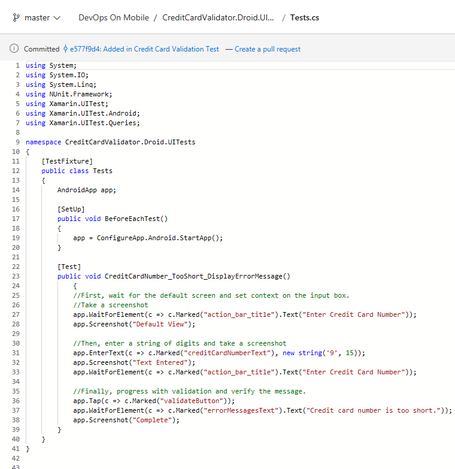

5. Navigate to [Xamarin Test Cloud](https://testcloud.xamarin.com/) in your web browser.

6. Select the New Test Run button in the top menu.

    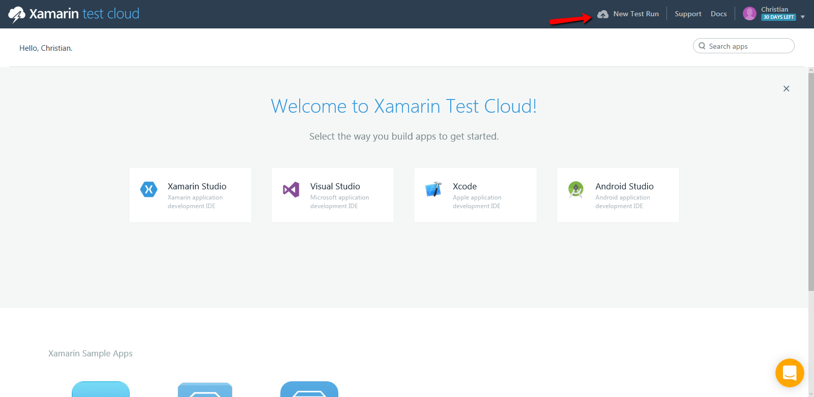

7. As we are developing an Android app in Xamarin, click on "I'm testing an Android app".

    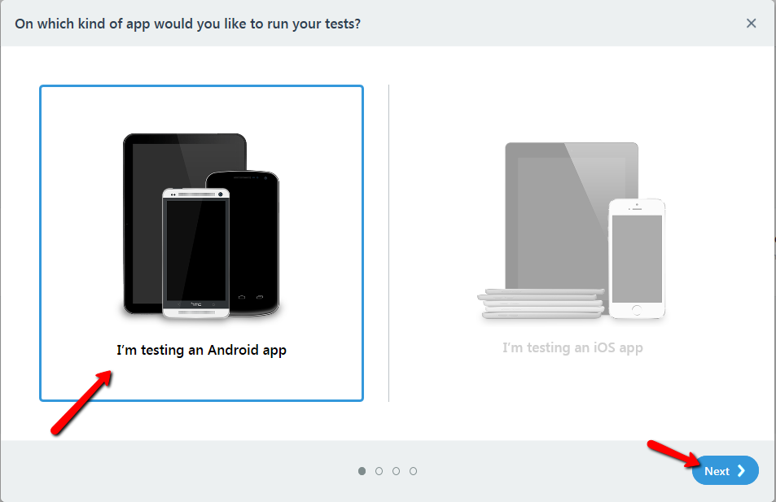

8. You can test your devices on a number of devices in Xamarin Test Cloud. On the next screen, you can select a set of the devices to be used within a test run.

    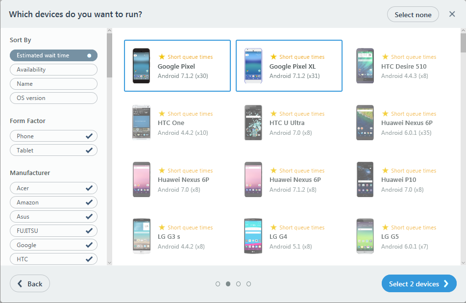

9. You will then need to specify metadata about the run (e.g. The Series for the test, as well as the system language).

    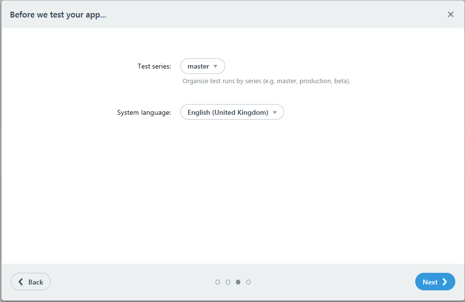

10. You will be presented with a view that shows the testing framework options. The output will vary, based upon the testing framework that you choose in addition to the Operating System.
    > **Note: Take note of the value for "devices". You will need this later on in the walkthrough.**

    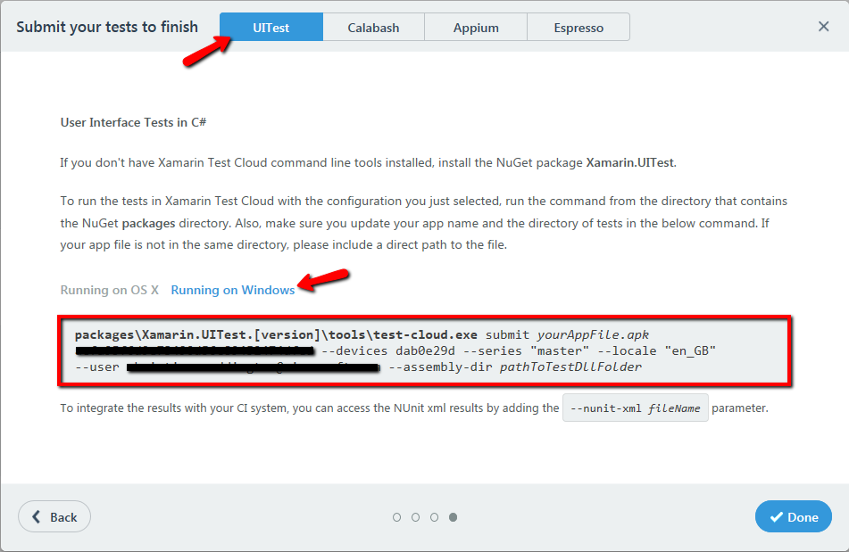

11. Select Done. Navigate to the **Account Settings** section in Xamarin Test Cloud. 

    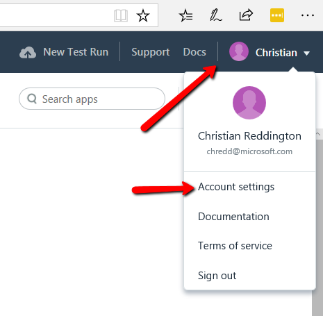

12. Navigate to the **Teams & Apps** section of the appropriate organisation in Xamarin Test Cloud.
    
    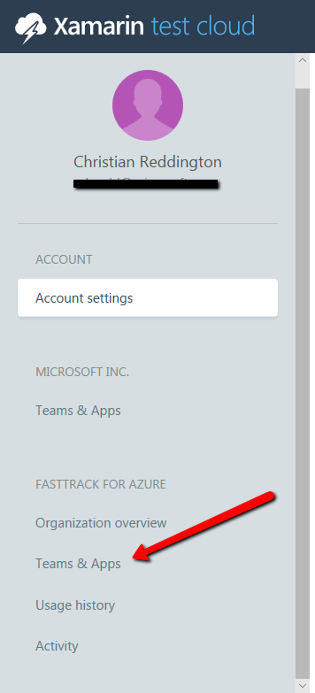

13. Select **Show API Key** on the resulting view.
    > **Note: Take note of this API Key. You will need this later on in the walk through**
    
    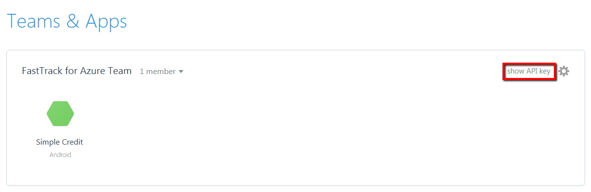

14. Navigate to the **Build tab** inside of Visual Studio Team Services. Create a new Build Definition.
    
    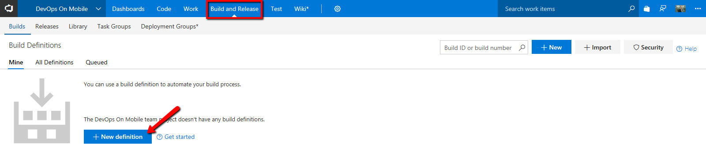

15. Search for **Xamarin templates** in the search box, and select the **Xamarin.Android template**.
    
    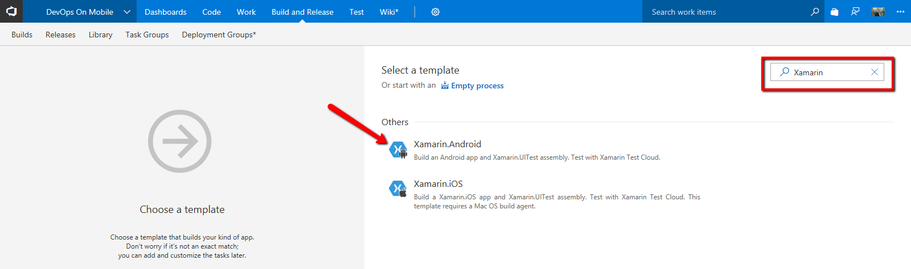

16. You will need to configure a number of items in the Build Definition;
    * **Agent Queue:** Hosted VS2017
    * **Team API Key:** Use the value that you had set aside earlier
    * **User Email:** Use the e-mail address that you login to Xamarin Test Cloud / where you would like to be notified
    * **Devices:** Use the device hash that you had set aside earlier

17. Navigate to the **Build Project** task. 
    * Configure Project to **CreditCardValidator.Droid.csproj**. If you do not complete this step, then you will likely encounter build failures, as the task will also attempt to build the Tests

18. Add an additional **Publish Artifact** task to the Build Definition.
    * Set **Path to publish** as **$(Build.SourcesDirectory)/packages/**
    * Set **Artifact name** as **packages**

19. Congratulations, you have a working build! Go ahead and navigate to the **Releases** tab in the **Build and Release** section.

    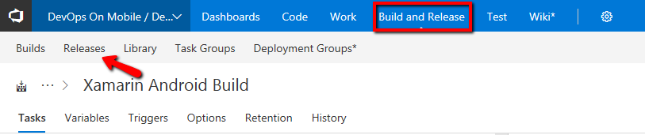

20. Create a new Release Definition, and start with an **empty process**.

21. Select **Artifacts** on the left hand side of the pipeline.
    * Click Add Artifact
    * Configure the **Source (Build Definition)** as the Build Definition that you had created earlier in this walkthrough
    * Click Add

22. Rename **Environment 1** to **Testing Environment.**
    * Create a Xamarin Test Cloud task in the Testing Environment.    
    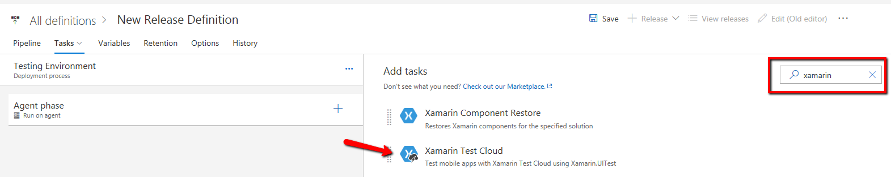

    * **App File:** Use the .apk file in your drop folder    
    * **Team API Key:** Use the value that you had set aside earlier
    * **User Email:** Use the e-mail address that you login to Xamarin Test Cloud / where you would like to be notified.
    * **Devices:** Use the device hash that you had set aside earlier
    * **Test Assembly Directory:** Configure this as the test-assembly folder inside of your drop folder
    * Once configured, click Save
    * Initiate a release


14. Navigate to Xamarin Test Cloud. You should see that your test run has completed successfully, without any failures. Click on the **Credit Card Number Too Short Display** test in the left hand menu.

    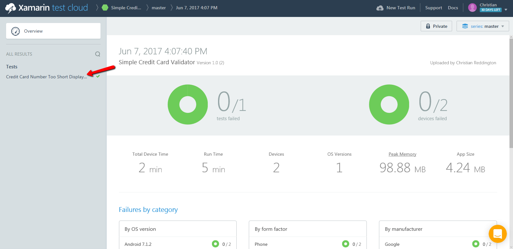

15. Recall back to the UITest that you copied in Step 4. It contained a number of app.Screenshot("") steps. As you can see in the screenshot below, this enables you to view the output of your application at multiple stages throughout your test.

16. Click on the Google Pixel image.

    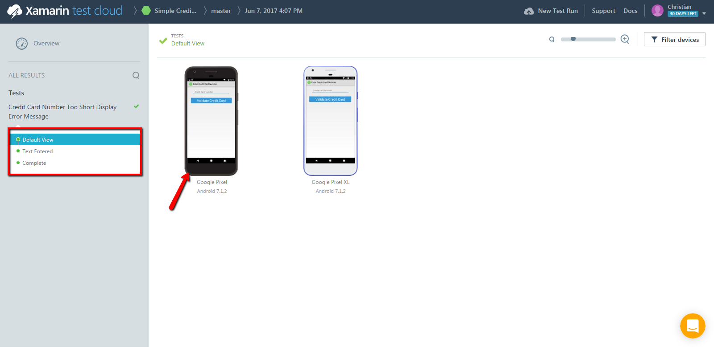

16. You can dig deeper into a particular device, if there was a failure. Now that we are on the Google Pixel page, we can select the **Device Log** option at the top of the page.

    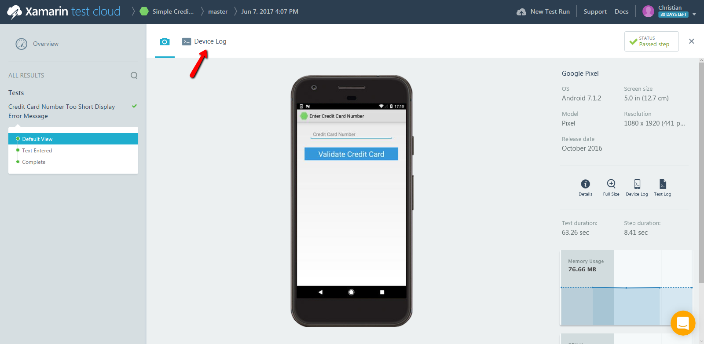

17. This **device log** allows you to view the output from the physical device on which your application test ran and is helpful if you have encountered a test failure.

    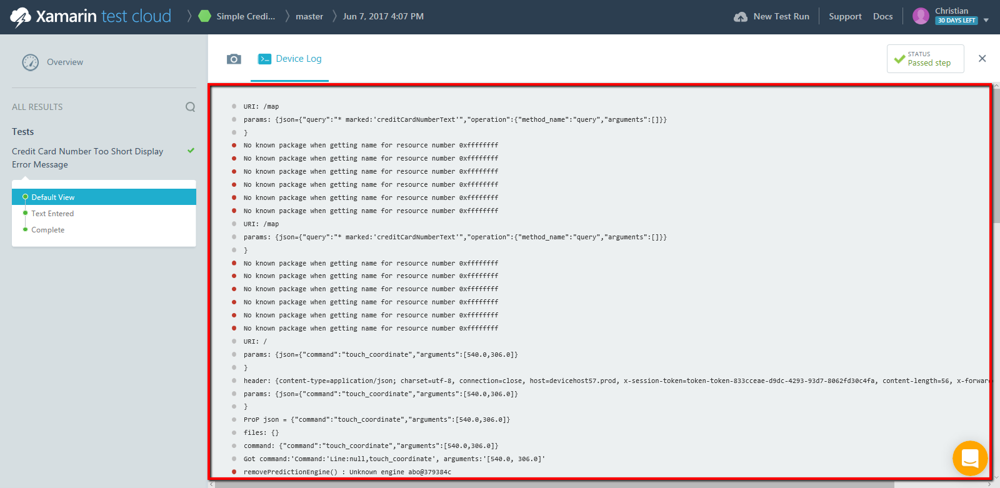

Congratulations, you have successfully executed a UITest for an Android project on Xamarin Test Cloud using a Google Pixel and Google Pixel XL.

If you later decided that you want to extend your testing across a larger pool of devices, then you can click on **New Test Run** in the top menu bar and generate a new Test Run. You would then select the CreditCardValidator application using a new pool of devices. This would then generate a different hash for your new pool of devices.

You will notice that the triggering of builds and releases was driven manually, though the process is set up to be repeatable. Consider reviewing the documentation around Build Triggers (Continous Integration / Scheduled Builds) and Release Triggers.

## Enhancing Your Pipeline

The example shown here is enough to get started to building and testing your application with VSTS and Xamarin Test Cloud. There are some additional steps you can take that, while not required, can help enhance your devops cycles.

While this example does not currently invoke any backend cloud services, most applications would. In a more realistic devops workflow, you would create an environment for cloud load testing.

In a release pipeline, this would exist either in parallel with or following the automated UI tests we just created and before you start pushing your application out to your users which will happen in the next section. An example of what that pipeline might look like is shown here.

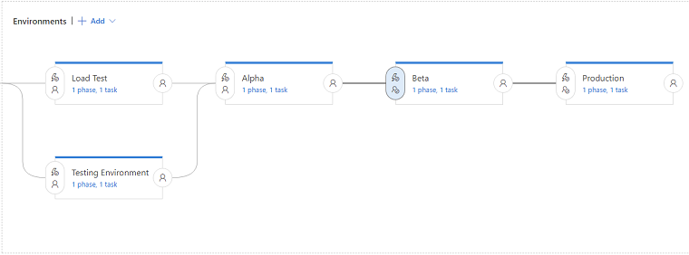

There are 2 ways you can run a load test: manually and automated. For manually scheduled tests, the Azure portal supports creating and running load tests for app services. Find out more information about [creating a load test from the Azure Portal](https://docs.microsoft.com/en-us/vsts/load-test/app-service-web-app-performance-test).

If you want to run load tests as part of your release pipeline, you would use Visual Studio to author your test file. Read more on [creating a load testing project](https://docs.microsoft.com/en-us/vsts/load-test/run-performance-tests-app-before-release). Once you have your test project created and in source control, you can invoke it from your release pipeline. In your environment, add a reference to the **Cloud-based Load Test** task and [configure the settings](https://docs.microsoft.com/en-us/vsts/load-test/getting-started-with-performance-testing#run-and-analyze-your-load-test) to your load test project.

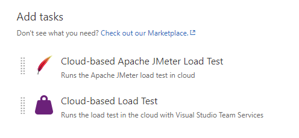

## Next Steps

You have successfully setup a UI Test for your Xamarin Android application. Now progress to the next module on [configuring HockeyApp in your app](hockey-app.md).

## References
* [Xamarin.Android Quickstart for Xamarin.UITest](https://developer.xamarin.com/guides/testcloud/uitest/quickstarts/android/)
* [Intro to Xamarin Test Cloud](https://developer.xamarin.com/guides/testcloud/introduction-to-test-cloud/)
* [Xamarin Test Cloud VSTS Task Reference](https://www.visualstudio.com/en-us/docs/build/steps/test/xamarin-test-cloud)
* [Load Testing with VSTS](https://docs.microsoft.com/en-us/vsts/load-test/)
* [Continuous Integration for Android with Visual Studio Team Services](https://blog.xamarin.com/continuous-integration-for-android-with-visual-studio-team-services/)
* [Windows Store Visual Studio Team Services Tasks](https://marketplace.visualstudio.com/items?itemName=MS-RDX-MRO.windows-store-publish)
* [Apple App Store Visual Studio Team Services Tasks](https://marketplace.visualstudio.com/items?itemName=ms-vsclient.app-store)
* [Continous Delivery to Google Play with Visual Studio Team Services](https://blog.xamarin.com/continuous-delivery-to-google-play-with-team-services/)