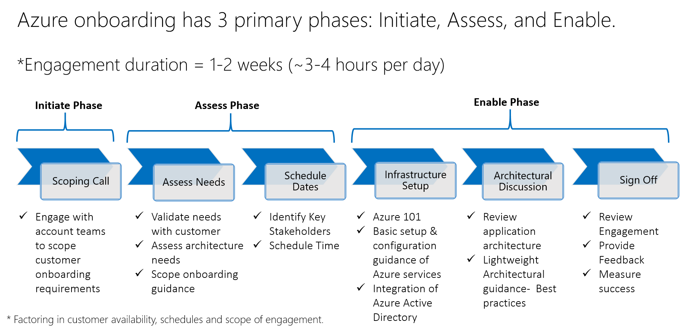

# Meet the team!
The Azure Onboarding team is a team of Azure engineers dedicated to customers with a structured and efficient onboarding experience to Azure. It is designed to assist new to Azure customers with foundational set up & configuration of Azure services and associated best practice guidance. 

# What are we offering?
Onboarding guidance will be applicable across multiple scenarios that leverage Azure infrastructure services and includes the following: 

### Overview of Azure 

### Set up & configuration guidance of Azure services 
* We will guide your technical team to provision compute, storage and to set up hybrid connectivity from on premises to Azure (point-to-site and site-to-site VPN).

### Architectural guidance to run a highly resilient app in Azure IaaS 
* We will work with your Architect to understand the solution and to review application architecture, dependencies and monitoring requirements. Based on the discussion we will provide best practices that enables you to deploy highly resilient and scalable applications in Azure.

### Integration of Azure Active Directory 
* For customers using Microsoft account we will enable you to migrate to organization account. This involves adding a domain to MS Azure Active Directory and Directory integration. We will also provide guidance to set up management policies using RBAC. 

# What is the Engagement Process?

# Onboarding Services Overview

## Overview of Azure

### Set up & configuration guidance of Azure infrastructure
* Guide your technical team to provision compute, storage and set up hybrid connectivity

### Architectural guidance
* Understand the solution and review application architecture.
* Provide best practices that enables you to deploy highly resilient and scalable applications in Azure.

### Integration of Azure Active Directory
* For Microsoft accounts, we will enable you to migrate to organization accounts.
* We will provide guidance to set up management policies using RBAC (Role Based Access Control).

## Azure Portal Tour
* [Getting started with the Azure Portal](https://github.com/Azure/onboarding-guidance/blob/master/PortalTour101.md)

## Setup & Configuration
### Basic Setup
* [Lesson 1. Azure 101 Presentation](https://github.com/Azure/onboarding-guidance/blob/master/windows/Module%200/L1-Azure101.md)
* [Lesson 2. Basic Setup Introduction](https://github.com/Azure/onboarding-guidance/blob/master/windows/Module%200/L2-SetupIntro.md)
* [Lesson 3. Azure to PowerShell Setup](https://github.com/Azure/onboarding-guidance/blob/master/windows/Module%200/L3-AzurePowershellSetup.md)
* [Lesson 4. Connect to Azure using PowerShell](https://github.com/Azure/onboarding-guidance/blob/master/windows/Module%200/L4-ConnectToAzure.md)

### Core Setup - Azure Storage
* [Lesson 1. Storage Introduction](https://github.com/Azure/onboarding-guidance/blob/master/windows/Module%20I/L1-StorageIntro.md)
* [Lesson 2. Create a Storage Account](https://github.com/Azure/onboarding-guidance/blob/master/windows/Module%20I/L2-StorageAccountMetricsLogging.md)

### Core Setup - Virtual Machine
* [Lesson 1. Compute Introduction](https://github.com/Azure/onboarding-guidance/blob/master/windows/Module%20II/L1-ComputeIntro.md)
* [Lesson 2. Azure Resource Group Management](https://github.com/Azure/onboarding-guidance/blob/master/windows/Module%20II/L2-AzureRMResourceGroupMgmt.md)
* [Lesson 3. Find desired image on Azure Platform](https://github.com/Azure/onboarding-guidance/blob/master/windows/Module%20II/L3-FindAPublishedImage.md)
* [Lesson 4. Create a new VM from Gallery Image](https://github.com/Azure/onboarding-guidance/blob/master/windows/Module%20II/L4-CreateVirtualMachineGI.md)
* [Lesson 5. Capture a windows VM as an Image on Azure](https://github.com/Azure/onboarding-guidance/blob/master/windows/Module%20II/L5-CaptureWindowsVMImage.md)
* [Lesson 6. Create a new VM from a captured Image on Azure](https://github.com/Azure/onboarding-guidance/blob/master/windows/Module%20II/L6-DeployCapturedVM.md)
* [Lesson 7. Upload a Windows OS Image (Syspreped) / Windows OS VHD(Non Syspreped)](https://github.com/Azure/onboarding-guidance/blob/master/windows/Module%20II/L7-UploadedVMfromOnpremise.md)
* [Lesson 8. Create a new VM from an existing Disk/uploaded image & Vhd](https://github.com/Azure/onboarding-guidance/blob/master/windows/Module%20II/L8-DeployVMuploadedVHD.md)

### Core Setup - Virtual Network
* [Lesson 1. Azure Networking Introduction](https://github.com/Azure/onboarding-guidance/blob/master/windows/Module%20III/L1-NetworkIntro.md)
* [Lesson 2. Create a Virtual Network](https://github.com/Azure/onboarding-guidance/blob/master/windows/Module%20III/L2-CreateVirtualNetwork.md)
* [Lesson 3. Create Point to site Connection (On-premises to Azure)](https://github.com/Azure/onboarding-guidance/blob/master/windows/Module%20III/L3-Point2Site.md)
* [Lesson 4. Create Site to site Connection (On-premises to Azure)](https://github.com/Azure/onboarding-guidance/blob/master/windows/Module%20III/L4-Site2SiteAuzreonPremise.md)
* [Lesson 5. Connect two Virtual Network (Azure to Azure)](https://github.com/Azure/onboarding-guidance/blob/master/windows/Module%20III/L5-Site2Site2Vnets.md)

## Architectural Guidance
* Scope and Discovery
* Architecture Design Review
* Architecture Mapping
* Dependency Mapping
* Best Practice Discussion
