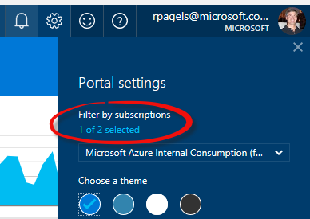

# Find desired image on Azure Marketplace

# Abstract

During this module, you will walk through on how to find an VM image for example: Ubuntu from Azure Marketplace.

# Learning objectives
After completing the exercises in this module, you will be able to:
* Find images on Azure Marketplace 

# Prerequisite 
None

# Estimated time to complete this module:
Self-guided

# Launch the Azure Portal
* Launch the Azure Portal, click [Azure Portal](http://www.azure.portal.com)

* Make sure to select the correct **Subscription**. Click the Settings (wheel icon on the top right corner) and click **Switch Directories** or **Filter by subscriptions**

* From left navigation bar, click **New** | **Marketplace** | **See all**.
* In the search box, enter **Ubuntu**, hit **Enter**
* Search result will bring up all Ubuntu VM images available in the Marketplace. If needed you can create a VM by selecting one of the VM image. For this walkthrough VM creation is not needed.

# See the following resources to learn more
:memo: [**Supporting Resources**](https://github.com/Azure/onboarding-guidance/blob/master/SupportingResources/SR-Compute.md)

