# Create a new VM from Azure Marketplace image 

# Abstract

During this module, you will walk you through on how to create Virtual Machine by selecting an image from Azure Marketplace, create Virtual Network, Subnet and place them VM in Availability set.

# Learning objectives
After completing the exercises in this module, you will be able to:
* Create a new VM from an Azure Marketplace image

# Prerequisite 
None

# Estimated time to complete this module:
Self-guided

# Launch the Azure Portal
* Launch the Azure Portal, click [Azure Portal](http://www.azure.portal.com)

* Make sure to select the correct **Subscription**. Click the Settings (wheel icon on the top right corner) and click **Switch Directories** or **Filter by subscriptions**

* From left navigation bar, click **New** | **Marketplace** | **See all**.
* In the search box, enter **windows server 2012 r2 datacenter**, hit **Enter**

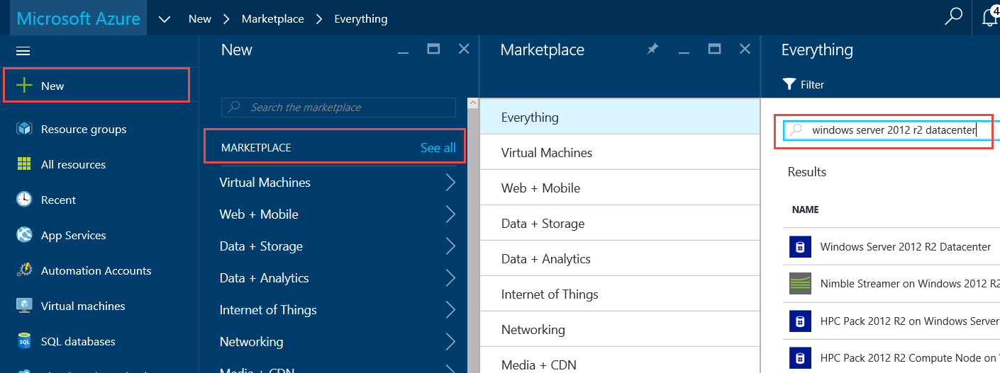

* :memo: Search result will bring up all windows server 2012 r2 datacenter VM images available in the Marketplace. If needed you can create a VM by selecting one of the VM image. For this walkthrough VM creation is not needed.

* Select the **windows server 2012 r2 datacenter** image. 
* On the **Windows Server 2012 R2 Datacenter** blade, make sure **Resource Manager** is selected from: Select a deployment model dropdown.

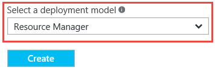

* Click **Create**
* For Basics blade enter the following values:
  * Name: format: **servicename-role[number]-vm**
    * example: **azureft-web1-vm**
  * VM disk type: **HDD**
* User name: <**user name**>
* Password: <**password**>
* Confirm password: <**password**>
* Subscription: <**select appropriate subscription**>
* Resource group: Select **Use existing** | <**Use the Resource group created in Storage Lesson 2**>
  * example: **azureft-dev-rg**
* Location: <**select appropriate location**>

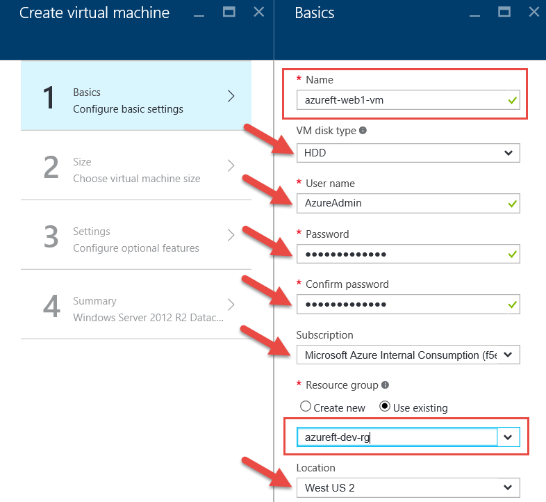

* Click **Ok**

* On the **Size** blade, select appropriate VM size, click **Select**.
  * example: **D1_V2 Standard**. If needed, click View All link to view all the VM sizes available.

 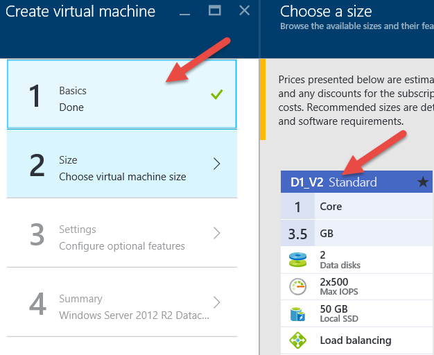

* On the **Settings** blade, enter the following values:
  * **Storage account**: select the storage account created in the previous lesson.
  * example: **azureftdat001**
  * Virtual network: format: <**servicename**>-<**region**>-**vnet**
    * example: **azureft-usw2-vnet** 
  * Address space: 10.0.0.0/16 (make sure this IP range doesn’t conflict with other VNET IP range on Azure or on-premises IP range if this VNET needs to be connected to other VNET or on-premises network)
  * Subnet name: format: <**servicename**>-<**tiername**>-**snet**
    * example: **azureft-web-snet**
    * subnet address range: **10.0.0.0/24**

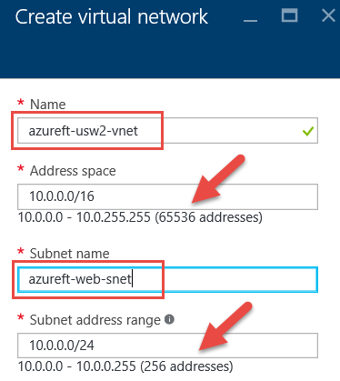

* Select **Public IP address**: format: <**servicename**>-<**role**>**number**-vm-pip
    * example: **azureft-web1-vm-pip**
    * Assignment: **Dynamic**

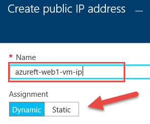

* Click **OK**

*  Select **Network security group (firewall)**: format: <**servicename**>-<**role**>**number**-vm-nsg
    * example: **azureft-web1-vm-nsg**
    * Inbound rules & Outbound rules: Leave default values.

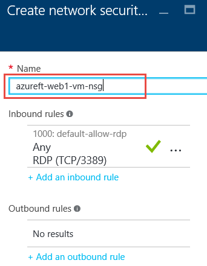

* Click **OK**
* Extensions: **No extensions**
* Select **Availability set**, then click **Create new**.
* Enter name: format: <**servicename**>-<**tiername**>-as
    * example: **azureft-web-as**
    * Update domains: **5**
    * Fault domains: **3**

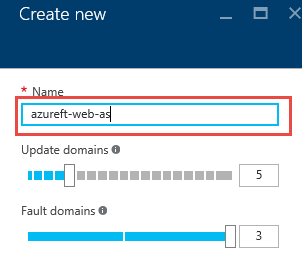
    
* Click **OK**

* Monitoring: **Enabled**
* Select **Diagnostics storage account**:
* Click **Create new**
* Name: format: <**servicename**><**tiername**>stdiag
    * example: **azureftwebstdiag**
* Performance: **Standard**
* Replication: **Locally-redundant storate (LRS)**

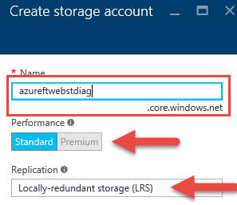

* Click **OK**

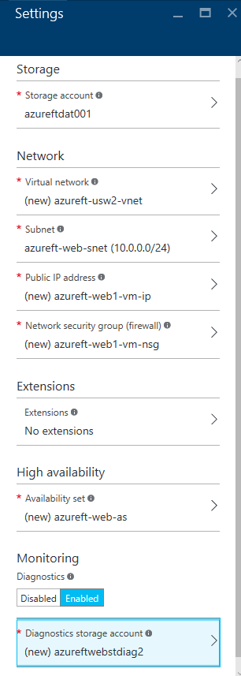

* Click **OK** (on the Settings blade)

* On the **Summary** blade, verify everything click **OK**.

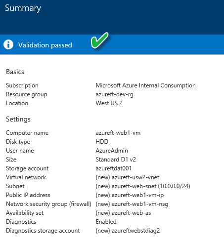

* This will start the process of creating VM.

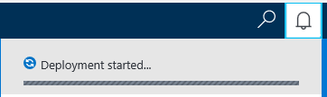

* To verify VM (or any resources) creation status, click Notification (bell icon on the top right corner). Make sure it is created first before moving on to the next step.

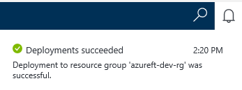

# See the following resources to learn more
:memo: [**Supporting Resources**](https://github.com/Azure/onboarding-guidance/blob/master/SupportingResources/SR-Compute.md)

