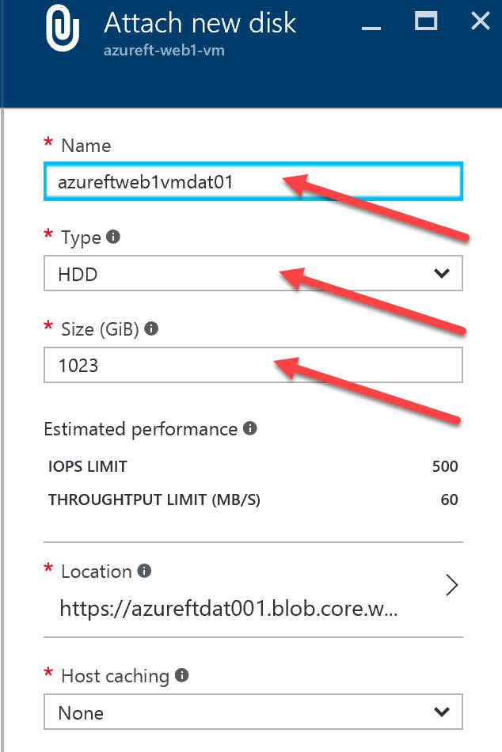
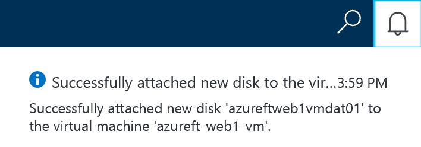
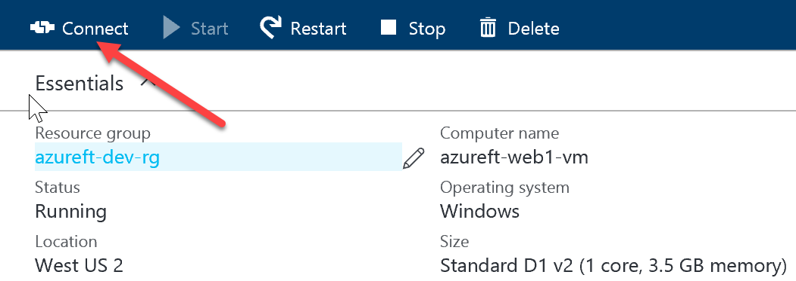

# Data disk management

# Abstract

During this module, you will learn how to attach a data disk to an existing VM via Azure Portal then connect to the VM and format the disk. 

# Learning objectives
After completing the exercises in this module, you will be able to:
* Attach a data disk to an existing VM.

# Prerequisite 
None

# Estimated time to complete this module:
Self-guided

# Launch the Azure Portal
* Launch the Azure Portal, click [Azure Portal](http://www.azure.portal.com)

* Make sure to select the correct **Subscription**. Click the Settings (wheel icon on the top right corner) and click **Switch Directories** or **Filter by subscriptions**

 
* From left navigation bar, click **Virtual Machines**.
  * On the **Virtual Machines** page, select the VM
    * example: **azureft-web1-vm** to which data disk needs to be added.
  * Under the **Settings**, click **Disks**
  * From the **next blade**, click **Attach new**
  * Enter following details:
  * Name: Format (storage account for VM data disk): <**vm name without dashes**>dat<**number**>
  * example: **azureftweb1vmdat01**
  * Type: **HDD** (or SSD if premium storage needed)
  * Size: **1023**
  * Leave rest of the values default
  * Click **OK**

* To verify data disk (or any resources) creation status, click **Notification** (bell icon on the top right corner). Make sure it is created first before moving on to the next step.

 
  * From left navigation bar, click **Virtual Machines**
  * From the **Virtual Machines** page, select the VM
    * example: **azureft-web1-vm** to which we just attached the data disk 
  * Click **Connect** on the top to RDP into the VM

 
  * Once you RDP in to the VM successfully, you should see **Server Manager**, if not open it up
  * From **Server Manager**, click **Tool** then **Computer Management**
  * From the **Computer Management**, expand **Storage** click **Disk Management**
  * This will bring up **Initialize Disk** dialog box
  * Leave default values, click **OK**
  * Now the Disk (for instance 1023 GB) will say **Unallocated**
  * Right click on the Disk and select **New Simple Volume**
  * In the New **Simple Volume** Wizard, click **Next**
  * In the next **Specify Volume Size** step, leave default values, click **Next**
  * Select appropriate drive letter (for instance E) and click **Next**
  * In the **Format Partition** step, leave default values (or change according to your requirement) and click **Next**
  * Click **Finish**
  * Now disk should be formatted and drive letter is assigned
  *	Open up a **Windows Explorer**, go to the Drive (for instance E drive) we just formatted and here you can create a file or folder as needed.

# See the following resources to learn more
