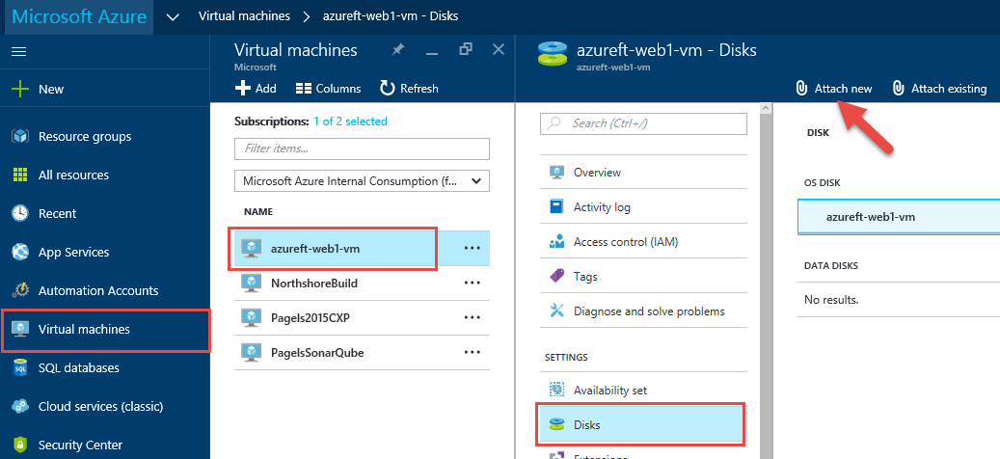
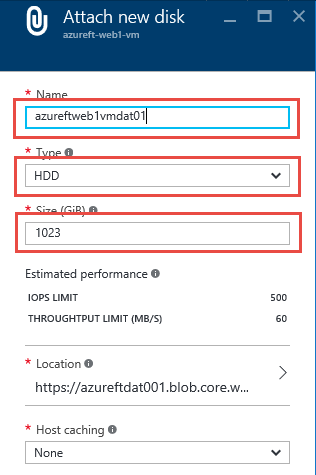
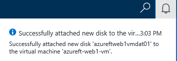

# Data disk management 

# Abstract

During this module, you will learn how to attach a data disk to an existing VM. 

# Learning objectives
After completing the exercises in this module, you will be able to:
* Attach a data disk to an existing VM.

# Prerequisite 
None

# Estimated time to complete this module:
Self-guided

# Launch the Azure Portal
* Launch the Azure Portal, click [Azure Portal](http://www.azure.portal.com)

* Make sure to select the correct **Subscription**. Click the Settings (wheel icon on the top right corner) and click **Switch Directories** or **Filter by subscriptions**

* From left navigation bar, click **Virtual Machines**.
* From the Virtual Machines page, select the VM (example: **azureft-web1-vm**) to which data disk needs to be added.
* Under SETTINGS, click **Disks**
* From the next blade, click **Attach new**

* Enter following details
  * Name: format (storage account for VM data disk): <**vm name without dashes**>dat<**number**>
    * example: **azureftweb1vmdat01**
    * Type: **HDD** (or SSD if premium storage needed)
    * Size: **1023**
    * Leave rest of the values default

* Click **OK**

* To verify data disk (or any resources) creation status, click Notification (bell icon on the top right corner). Make sure it is created first before moving on to the next step.

* From left navigation bar, click **Virtual Machines**.
* From the Virtual Machines page, select the VM (example: **azureft-web1-vm**) to which we just attached the data disk.
* Under SETTINGS, click **Disks**

#  To be continued...
* more steps....

# See the following resources to learn more
:memo: [**Supporting Resources**](https://github.com/Azure/onboarding-guidance/blob/master/SupportingResources/SR-Compute.md)

