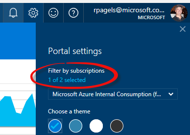

# Create a Virtual Network and Subnet

# Abstract

During this module, you will learn how to create a VNet by using the Resource Manager deployment model.

# Learning objectives
After completing the exercises in this module, you will be able to:
* Create a VNET.

# Prerequisite 
None

# Estimated time to complete this module:
Self-guided

# Launch the Azure Portal
* Launch the Azure Portal, click [Azure Portal](http://www.azure.portal.com)

* Make sure to select the correct **Subscription**. Click the Settings (wheel icon on the top right corner) and click **Switch Directories** or **Filter by subscriptions**

