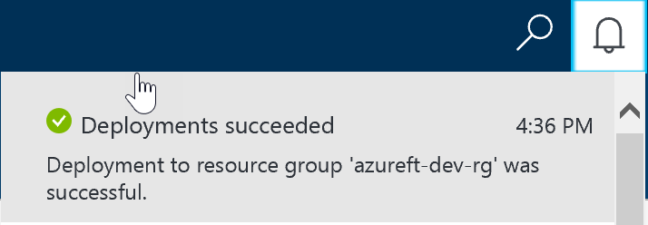

# Create and configure a load balancer

# Abstract

During this module, you will learn how to create a load balancer, add Probes, Backend pools and Load balancing rules.

> Having two or more VMs in an Availability Set is a pre-requisite to fully create and configure Load balancer. So if two VMs are not created and in Availability set, go back VM creation lesson to complete this step. 

# Learning objectives
After completing the exercises in this module, you will be able to:
* Create and configure a load balancer across VMs.

# Prerequisite 
None

# Estimated time to complete this module:
Self-guided

# Launch the Azure Portal
* Launch the Azure Portal, click [Azure Portal](http://www.azure.portal.com)

* Make sure to select the correct **Subscription**. Click the Settings (wheel icon on the top right corner) and click **Switch Directories** or **Filter by subscriptions**

 
* From left navigation bar, click **Load balancers**.
  * > If Load balancers is not available, click **More Services** (towards the bottom of the left navigation bar). In the filter type Load balancers, click the star icon (*) right next to Load balancers, this will pin the Load balancers to the left navigation bar.

  * From the **Load balancer** page, click **Add**
  * In the **Create load balancer** blade, enter the following details
  * Name: Format: <**service name**>-<**tier name**>-lb
    * example: **azureft-web-lb**
  * Type: **Public** (or Internal if you want to load balance internal traffic)
  * Select **Public IP address**. 
  * In the **Choose Public IP** address blade, click **Create new**. 
  * In the **Create public IP** address blade, enter **Name**
  * Name: Format: <**service name**>-<**tier name**>-pip
    * example: **azureft-web-pip**
  * Assignment: **Static**  
  * Click **OK**
  * Subscription: <**select appropriate subscription**>
  * Resource group: Select **Use existing**.
    * Use the Resource group created in previous lesson, for instance: **azureft-dev-rg**
  * Location: <**select appropriate location**>
  * Click **Create**

 
* To add **Probes**, from left navigation bar, click **Load balancers**.
  * Select the **Load balancer** just created for instance: **azureft-web-lb** 
  * From the next blade, click **Probes** then click **Add**
  * In the **Add probe** blade, enter the following details
  * Name: Format: <**service name**>-<**tier name**>-lbprobe
    * example: **azureft-web-lbprobe**
  * Protocol: **HTTP**
  * Leave rest of the values default, click **OK**

* To add VMs to the Load balancer Backend pools, from left navigation bar, click **Load balancers**
  * Select the Load balancer just created for instance: **ureft-web-lb** 
  * From the next blade, click **Backend pools** under **Settings** then click **Add**
  * In the **Add backend pool** blade, enter the following details
  * Name: Format: <**service name**>-<**tier name**>-lbpool
    * example: **azureft-web-lbpool**
  * Click **Add a virtual machine** 
  * From **Choose virtual machines** blade, click **Availability set**
  * From **Choose an availability** set blade, select the **Availability set** created previously for instance: **azureft-web-as**
  * From **Choose virtual machines** blade, click **Virtual machines**
  * From **Choose virtual machines** blade, click select two VMs, for instance **azureft-web1-vm** & **azureft-web2-vm** then click **Select**
  * On the **Choose virtual machines** blade, click **OK**
  * On the **Add backend pool** blade, click **OK**
  * To verify Backend pools creation status, click **Notification** (bell icon on the top right corner). Make sure it is created first before moving on to the next step.

* To create **Load balancing rules**, from left navigation bar, click **Load balancers**
  * Select the Load balancer just created for instance: **azureft-web-lb** 
  * From the next blade, click **Load balancing rules** under Settings then click **Add**
  * In the **Add load balancing rule**, enter the following details
  * Name: Format: <**service name**>-<**tier name**>-<**service**>-lbr
    * example: **azureft-web-http-lbr**
  * Leave rest of the following values default
  * Protocol: **TCP**
  * Port: **80**
  * Backend port: **80**
  * Backend pool: <**pool with two VMs will be auto selected**>
  * Probe: <**probe will be auto selected**>
  * Session persistence: **None**
  * Idle timeout (minutes): **4**
  * Floating IP: **Disabled**
  * Click **OK**

# See the following resources to learn more
