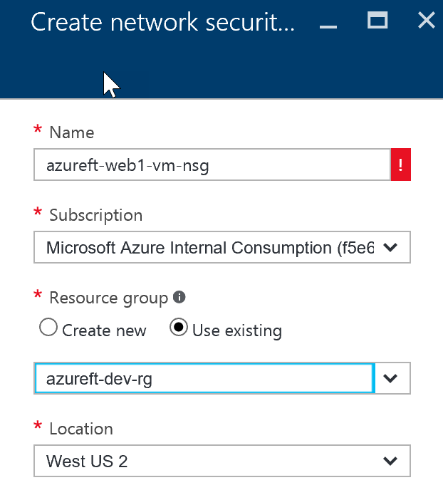
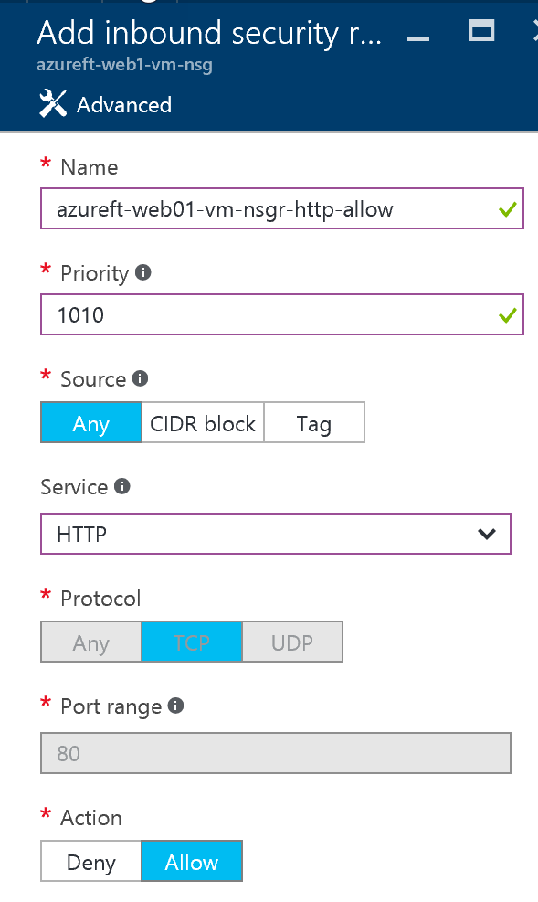

# Create and configure Network Security Groups (NSG)

# Abstract

During this module, you will learn how to create a Network Security Groups (NSG), add HTTP Allow rule and attach to a subnet under VNET.

> Alternatively, NSG can be attached to VM’s Network Interface (NIC) as well. 

# Learning objectives
After completing the exercises in this module, you will be able to:
* Create and configure a Network Security Group

# Prerequisite 
None

# Estimated time to complete this module:
Self-guided

# Launch the Azure Portal
* Launch the Azure Portal, click [Azure Portal](http://www.azure.portal.com)

* Make sure to select the correct **Subscription**. Click the Settings (wheel icon on the top right corner) and click **Switch Directories** or **Filter by subscriptions**

 
* From left navigation bar, click **Network Security Groups**.
  > If Network Security Groups is not available, click **More Services** (towards the bottom of the left navigation bar). In the filter, type **Network Security Groups**, click the star icon (*) right next to **Network Security Groups**, this will pin the Network Security Groups to the left navigation bar.

  * From the Network Security Groups page, click **Add**
  * In the **Create Network Security** Group blade, enter the following details
  * Name: Format for VMs NSG: <**vm name**>-nsg
    * example: **azureft-web1-vm-nsg**
  * Subscription: <**select appropriate subscription**>
  * Resource group: Select Use existing. <Use the Resource group created in previous lesson, for instance: **azureft-dev-rg**>
  * Location: <**select appropriate location**>
  * Click **Create**
  > The following steps will walk through on how to add HTTP Allow rule.
  * Once NSG is created successfully, select the NSG. Under **Settings** select **Inbound security rules**.
  * Click **Add**
  * In the **Add inbound security rule** blade, enter the following details
  * Name: Format: <**vm name**>-nsgr-<**service**>-<**action**>
    * example: **azureft-web01-vm-nsgr-http-allow**
  * Priority: <**Enter appropriate value. The lower the number, the higher the priority**>. Example:**1010**
  * Source: <**Select appropriate value. Example: Any**>
  * Service: <**Select appropriate value. Example: HTTP**>
  * Leave rest of the following values default
  * Protocol: **TCP**
  * Port range: **80**
  * Action: **Allow**
  * Click **OK**

* > This NSG can be attached to a VM’s NIC or to a Subnet under VNET. When VMs are created by default a NSG will get created and attached to VM’s NIC. This NSG will allow inbound RDP connections. If additional NSG rules (for example: HTTP Allow) needs to be added to VM’s NIC, you can go do VMs Network Interface, select existing NSG and add/delete rules to Inbound security rules or Outbound security rules. This is a right way to do it rather than creating new NSG and adding to VM’s NIC.

* Following steps will walk through on how to add NSG to a Subnet under a VNET.
  > If VNET and subnet hasn’t created, make sure to create them first. Create a new VM from Azure Marketplace image lesson will walkthrough on how to create them first.
  * Select **Virtual networks** from left navigation bar. Select a **VNET**, For example: **azureft-usw2-vnet**
  * Select **Subnet** under **SETTINGS**
  * Select one of the subnet from the next blade. For example: **azureft-web-snet**
  * Select **Network security group** from next blade
  * From the **Choose network security group** blade, select appropriate **NSG**
  * Click **Save**

# See the following resources to learn more
