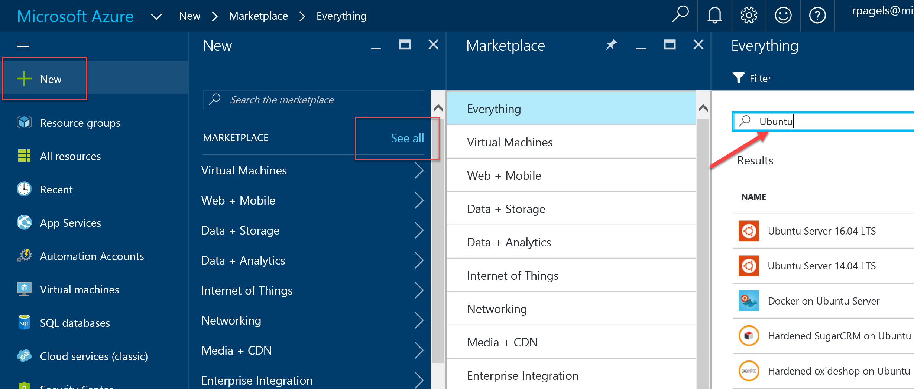
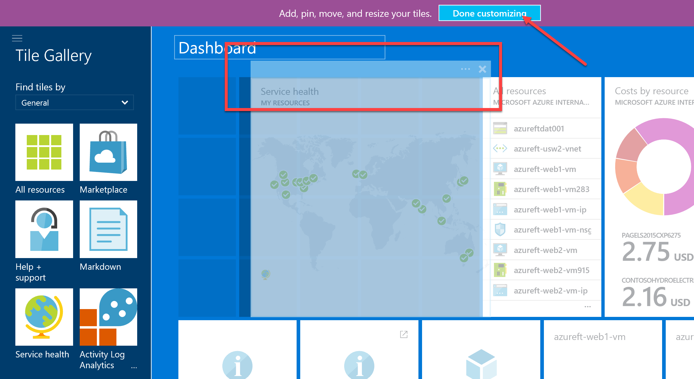
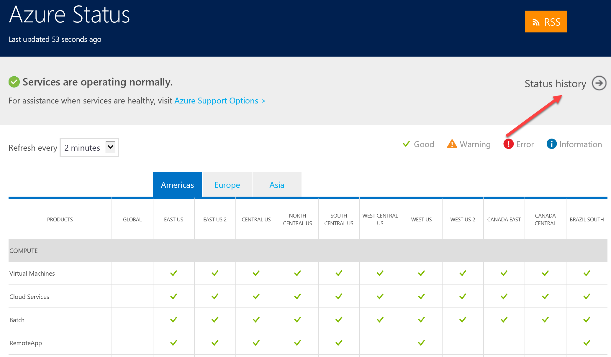
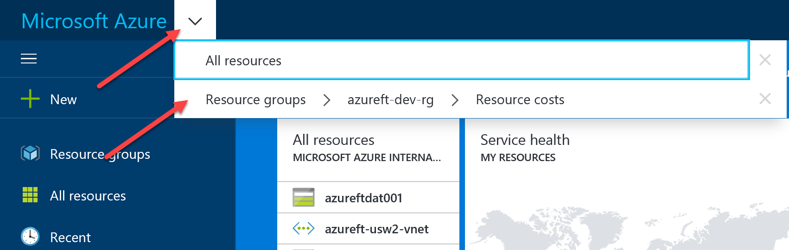

# Azure Portal Walkthrough

# Abstract

Have you heard the buzz about the Microsoft Azure Management Portal? The Portal a slick HTML5 website with accessibility from iPads, iPhones, and Android-based devices and is great from the desktop, too. Gone are the days of being able to browse your Azure-hosted website on your mobile device but not be able to check on your Web Role's status.

# Learning objectives
After completing the exercises in this module, you will be able to:
* Feel comfortable with the Azure portal and understand the basic navigation concepts.
* Build, manage, and monitor everything from simple web apps to complex cloud applications in a single, unified console

# Prerequisite 
* None

# Estimated time to complete this module:
Self-guided

# Getting to the Portal
You access the portal the same way you've always accessed it.
* [Visit the Azure Portal](https://portal.azure.com/)

# Example of Portal

# Navigation
  > The left navigation bar has links to all the resources that Azure provides.
The middle section shows a dashboard of pinned resources.
The top right most corner contains view settings for the portal.

# All Resources
  > This is a list of all the services you have available in your subscription.

  * Scroll to the bottom and Click on **More services** to search for a component.
  * Type **Virtual** to provide a list of items.
  * Click on the **Star** to pin it as a favorite on the left navigation list.

  

  * After it’s pinned, you can **click** and drag up or down to reposition in the list.
  * On the left navigation bar, click **All resources**.
  
  

  > This will list everything that you have on your portal or have access too from other subscriptions.

  * Click on the **down arrow** to filter results based on subscriptions. The services that are provided are categorized in different segments.

  * Click **New**.
  * Click **See all**, this shows you the marketplace segments. This is a list of services provided by Microsoft and our partners.
  * Type **Ubuntu** in the search box. This will show you everything related to Ubuntu. To deploy any of the images, you simply select the one you want.

# Dashboard
> You can easily customize dashboard and tiles.

  * Hoover over the **Services health** tile, then click on the **ellipses** in the upper right corner.
  > This allows you to customize the tile size. You can easily click and drag the tile into a different position on the grid.
  * Click on **tile** and move to the left. When you’re done, click the **Done customizing** button at the top.

  > This will give you a complete view of every service running and it’s health report per region.
  * **Right-click** anywhere on the Service health tile and select **Go to Azure Status page**.

  > This page shows all the services running on Azure and the status for a particular datacenter. If there are any services that are in an unhealthy state, it will be indicated by a different icon.
You can also look at the historical view to see the service health from the past.

  * Click on the **Status History** link in the upper right.

  > You can create new dashboards anytime.
  * Click on the **+ New dashboard** button. Type in **DevOps** for the title.
  * Drag a **tile** from left side and place it on the new dashboard to get started.

  > You can also pin any resource to your dashboard.
  * Click on **Resource groups** on the left navigation bar. On any of the services listed, click on the **ellipses** on the right and select **Pin to dashboard**.
  * Click the **Microsoft Azure** button in the upper left corner to return to the dashboard.

  > The portal has a breadcrumb feature to allow you to quickly jump back to where you left off. It will remember the last few paths.
  * Click the **down arrow** next to the Microsoft Azure button in the upper left corner.

  > You can clone any dashboard and customize it.
  * Click on the **Clone** button and enter a title **DevOps** Dashboard.

  > The Portal dashboards can be created and customized per user. The dashboard settings are persistent and will roam with the login, regardless of what machine they use. The portal is updated often, so you will automaticly see new functionality, bug fixes, and performance improvements.

# Portal Settings
  * **Search**. This will help you find any resources across subscriptions that you have access too.
  * **Bell**. This will tell you what action has been performed. It’s a notification method.
  * **Gear**. This will let you change your portal settings.
  * **Subscription filters**. When you’re working with multiple subscriptions, it’s important to know which one you selected.
    * Change **theme**
    * Change **color**
    * Change **language**
    * **Send feedback**. This will send the Azure PG direct feedback.
    * **Ask for help**. If you’re having any issues with Azure.
      > This will send a help request containing all the relevant information pulled from your current session. This will help the support engineer and escalate resolution to the problem with context aware information. i.e. virtual machine ID#, name, resource group name…etc.

* You can always click on the **Restore default settings** button to restore your dashboard to the default settings.

* The **What’s new** button will show you what has been released recently, similar to a news portal.

# See the following resources to learn more
* [Getting to the Azure Portal](https://pages.github.com/)
* [Video: Tips, Tricks, How Tos and the Azure Portal](https://www.youtube.com/watch?v=DASqJEs1NiQ)
