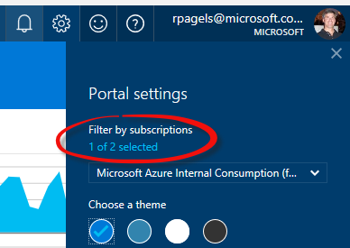
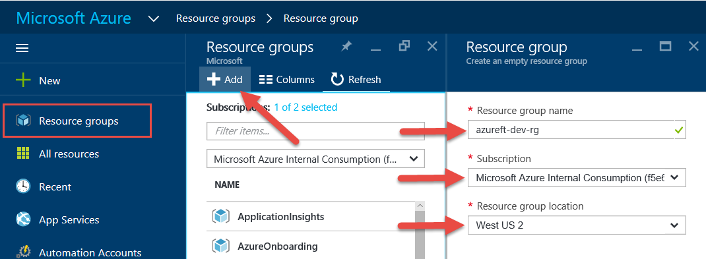
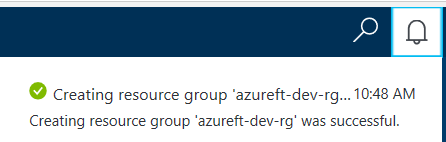

# Azure Resource Group Management

# Abstract

During this module, you will learn how to create a Resource Group

# Learning objectives
After completing the exercises in this module, you will be able to:
* Create a Resource Group

# Prerequisite 
None

# Estimated time to complete this module:
Self-guided

# Launch the Azure Portal
* Launch the Azure Portal, click [Azure Portal](http://www.azure.portal.com)

* Make sure to select the correct **Subscription**. Click the Settings (wheel icon on the top right corner) and click **Switch Directories** or **Filter by subscriptions**

 
* From left navigation bar, click **Resource groups**.
  * On the **Resource groups blade**, click **Add**.
  * Enter Resource Group Name: format: **(service short name)**-**(environment)**-rg, example: **azureft-dev-rg**
  * Select the correct **subscription**.
  * Select the **Resource group location**.

 
* Click **Create**
* To verify Resource Group (or any resources) creation status, click **Notification** (bell icon on the top right corner). Make sure it created first before moving on to the next step.

# See the following resources to learn more
:memo: [**Supporting Resources**](https://github.com/Azure/onboarding-guidance/blob/master/SupportingResources/SR-Storage.md)

