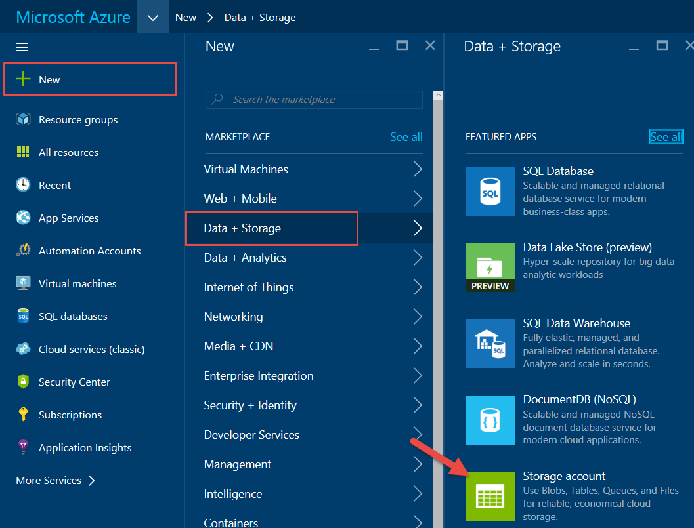
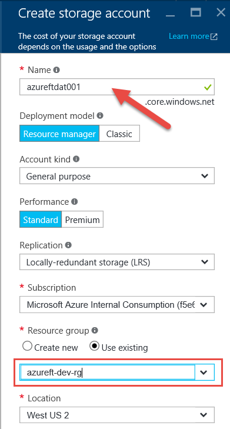
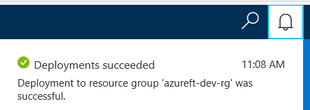

# Create a Storage Account

# Abstract

During this module, you will follow steps to walk you through creating Standard storage account for storing VHD file for VM. If Premium storage account needed, follow the same steps except, while selecting Performance select Premium.

# Learning objectives
After completing the exercises in this module, you will be able to:
* Create a Standard or Premium storage account

# Prerequisite 
None

# Estimated time to complete this module:
Self-guided

# Launch the Azure Portal
* Launch the Azure Portal, click [Azure Portal](http://www.azure.portal.com)

* Make sure to select the correct **Subscription**. Click the Settings (wheel icon on the top right corner) and click **Switch Directories** or **Filter by subscriptions**

 
* From left navigation bar, click **New** | **Data + Storage** | **Storage Account**.

  * Enter the following details for the Name:
    * format (storage account for data): **(service short name)(type)(number)**
    * example: **azureftdat001**
    * or
    * format (storage account for disks): **(vm name without dashes)st(number)**
    * example: **azureftweb1vmst0**

  * Deployment model: **Resource manager**
  * Account kind: **General purpose**
  * Performance: **Standard** 
  * Replication: **Locally-redundant storage (LRS)**
  * Subscription: **(select appropriate subscription)**
  * Resource group: Select **Use existing**. (Use the Resource group created in Lesson 2)
  * Location: **(select appropriate location)**

* Click **Create**

* To verify Storage Account (or any resources) creation status, click **Notification** (bell icon on the top right corner). Make sure it is created first before moving on to the next step.

* ### Repeat the above steps to create another storage account for diagnostics or another VM if needed.

# See the following resources to learn more
* [Supporting Resources](#)