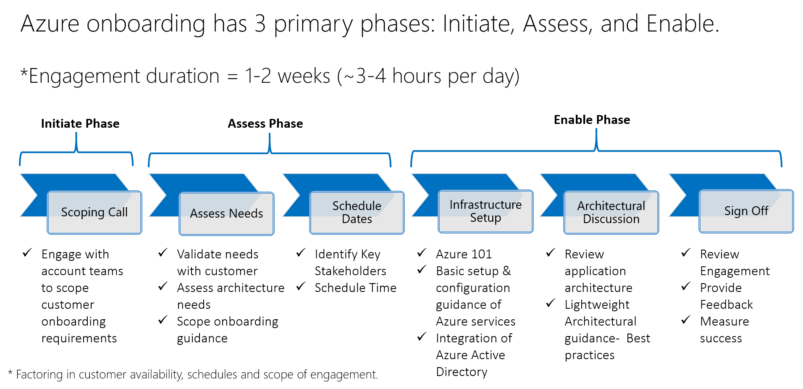

# Meet the team!
The Azure Onboarding team is a customer success service which will provide customers with a rich, efficient and friction free onboarding experience to Azure– accelerating the customer velocity from sale to onboarding to use.  It is designed to assist new to Azure customers with foundational set up & configuration of Azure services and associated best practice guidance. All customer engagement will be delivered remotely.

# Who are we?
## We are the Microsoft Azure Customer Experience (CXP) team!
* Customer obsessed engineering team
* Focused on delivering positive customer outcomes and experiences
* Proactively assisting customers

# What are we offering?
## We have created a new program (currently in pilot) for Azure customers, to provide you with a rich, efficient and no-charge onboarding experience to Azure.
* 100% Remote engagement
* Work directly with Azure Engineers
* Setup and configuration of Azure infrastructure (compute, storage, network)
* Receive architecture concepts, best practices and design principles

# What are the benefits?
## The benefits of the program is to provide customers with foundational guidance to get started on Azure in an effective manner.
* No-charge
* Direct engineering engagement to assess & assist with your Azure needs.
* Build your confidence in using Azure from day one
* Achieve a level of self-sufficiency with Azure
* Raise your quality of initial deployment enabling you to efficiently architect, build, and maintain your applications in Azure

# What is the Engagement Process?

# Onboarding Services Overview

## Overview of Azure

## Set up & configuration guidance of Azure services
* Guide your technical team to provision compute, storage and set up hybrid connectivity

## Architectural guidance
* Understand the solution and review application architecture
* Provide best practices that enables you to deploy highly resilient and scalable applications in Azure

## Integration of Azure Active Directory
* For Microsoft accounts, we will enable you to migrate to organization accounts.
* We will provide guidance to set up management policies using RBAC (Role Based Access Control).

## Azure Portal Tour
* [Getting started with the Azure Portal](https://github.com/Azure/onboarding-guidance/blob/master/PortalTour101.md)

## Setup & Configuration
### Basic Setup
* [Lesson 1. Azure 101 Presentation](https://github.com/Azure/onboarding-guidance/blob/master/windows/Module%200/L1-Azure101.md)
* [Lesson 2. Basic Setup Introduction](https://github.com/Azure/onboarding-guidance/blob/master/windows/Module%200/L2-SetupIntro.md)
* [Lesson 3. Azure PowerShell Setup](https://github.com/Azure/onboarding-guidance/blob/master/windows/Module%200/L3-AzurePowershellSetup.md)
* [Lesson 4. Connect To Azure using PowerShell](https://github.com/Azure/onboarding-guidance/blob/master/windows/Module%200/L4-ConnectToAzure.md)

### Core Setup - Azure Storage
* [Lesson 1. Storage Introduction](https://github.com/Azure/onboarding-guidance/blob/master/windows/Module%20I/L1-StorageIntro.md)
* [Lesson 2. Create a Storage Account](https://github.com/Azure/onboarding-guidance/blob/master/windows/Module%20I/L2-StorageAccountMetricsLogging.md)

### Core Setup - Virtual Machine
* [Lesson 1. Compute Introduction](https://github.com/Azure/onboarding-guidance/blob/master/windows/Module%20II/L1-ComputeIntro.md)
* [Lesson 2. Azure Resource Group Management](https://github.com/Azure/onboarding-guidance/blob/master/windows/Module%20II/L2-AzureRMResourceGroupMgmt.md)
* [Lesson 3. Find desired image on Azure Platform](https://github.com/Azure/onboarding-guidance/blob/master/windows/Module%20II/L3-FindAPublishedImage.md)
* [Lesson 4. Create a new VM from Gallery Image](https://github.com/Azure/onboarding-guidance/blob/master/windows/Module%20II/L4-CreateVirtualMachineGI.md)
* [Lesson 5. Capture a windows VM as an Image on Azure](https://github.com/Azure/onboarding-guidance/blob/master/windows/Module%20II/L5-CaptureWindowsVMImage.md)
* [Lesson 6. Create a new VM from a captured Image on Azure](https://github.com/Azure/onboarding-guidance/blob/master/windows/Module%20II/L6-DeployCapturedVM.md)
* [Lesson 7. Upload a Windows OS Image (Syspreped) / Windows OS VHD(Non Syspreped)](https://github.com/Azure/onboarding-guidance/blob/master/windows/Module%20II/L7-UploadedVMfromOnpremise.md)
* [Lesson 8. Create a new VM from an existing Disk/uploaded image & Vhd](https://github.com/Azure/onboarding-guidance/blob/master/windows/Module%20II/L8-DeployVMuploadedVHD.md)

### Core Setup - Virtual Network
* [Lesson 1. Azure Networking Introduction](https://github.com/Azure/onboarding-guidance/blob/master/windows/Module%20III/L1-NetworkIntro.md)
* [Lesson 2. Create a Virtual Network](https://github.com/Azure/onboarding-guidance/blob/master/windows/Module%20III/L2-CreateVirtualNetwork.md)
* [Lesson 3. Create Point to site Connection (On-premises to Azure)](https://github.com/Azure/onboarding-guidance/blob/master/windows/Module%20III/L3-Point2Site.md)
* [Lesson 4. Create Site to site Connection (On-premises to Azure)](https://github.com/Azure/onboarding-guidance/blob/master/windows/Module%20III/L4-Site2SiteAuzreonPremise.md)
* [Lesson 5. Connect two Virtual Network (Azure to Azure)](https://github.com/Azure/onboarding-guidance/blob/master/windows/Module%20III/L5-Site2Site2Vnets.md)

## Architectural Guidance
* Scope and Discovery
* Architecture Design Review
* Architecture Mapping
* Dependency Mapping
* Best Practice Discussion
