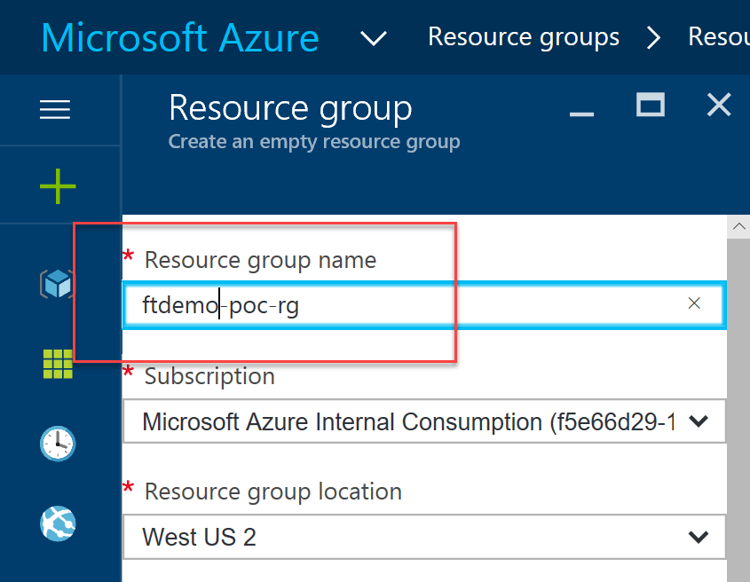
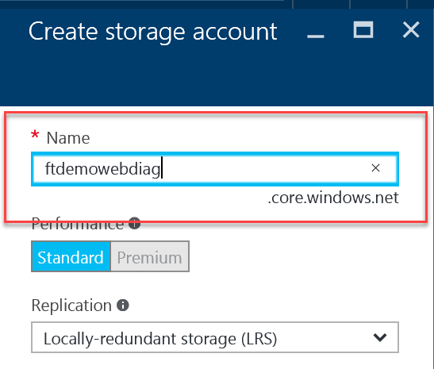
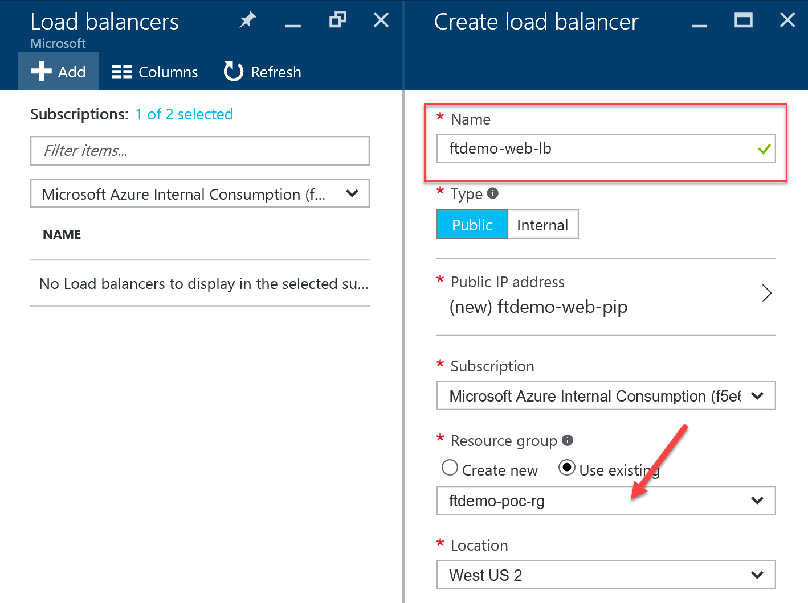
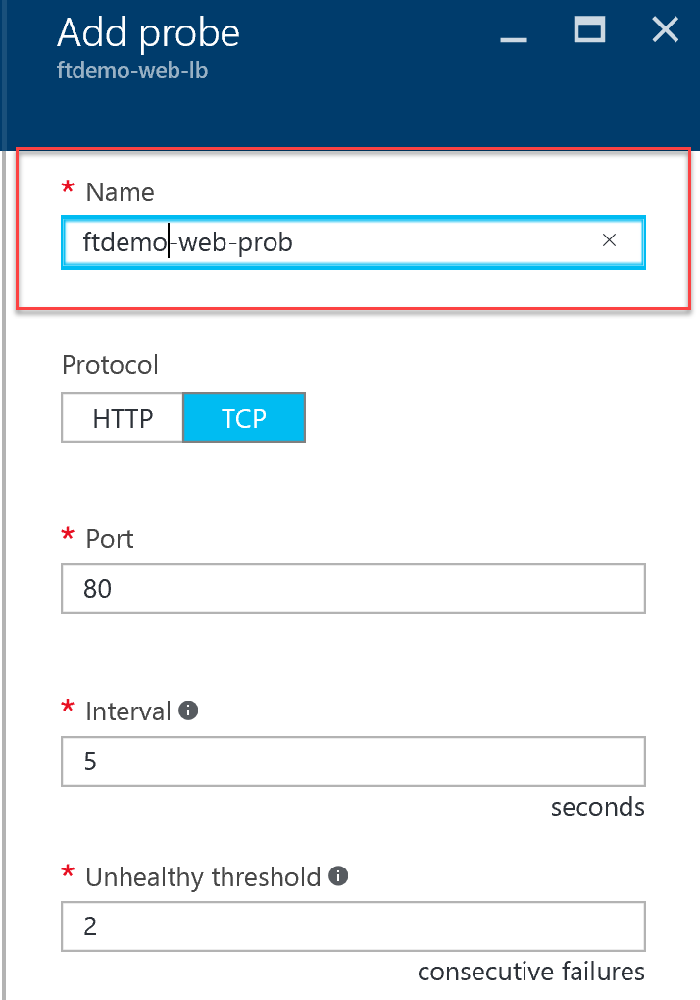
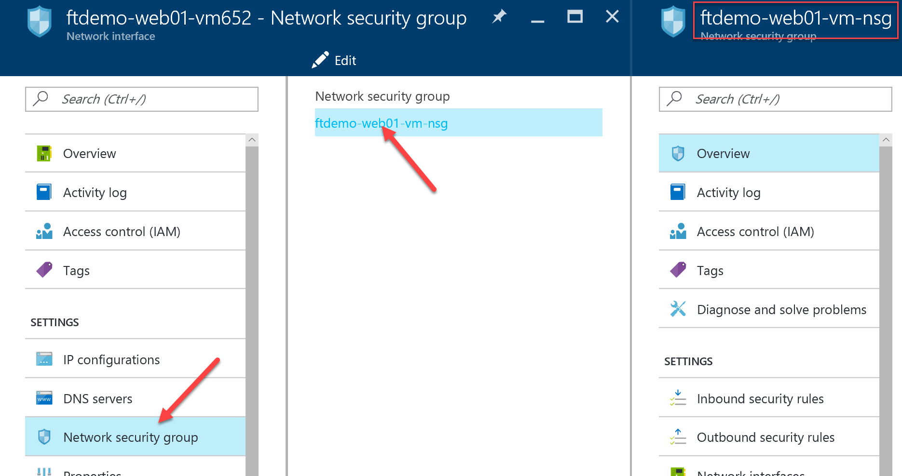
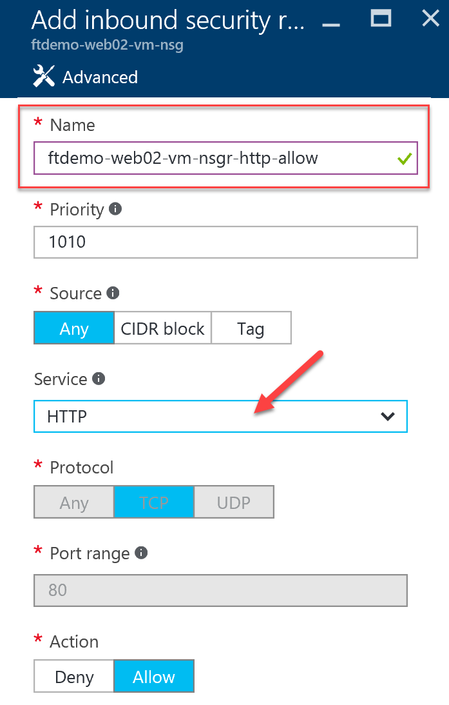

# POC Scenario 1: Deploying Website on Azure IaaS VMs - HTTP

## Table of Contents
* [Abstract](#abstract)
* [Learning objectives](#learning-objectives)
* [Prerequisites](#prerequisites)
* [Estimated time to complete this module](#estimated-time-to-complete-this-module)
* [Customize your Azure Portal](#customize-your-azure-portal)
* [Resource Group creation](#resource-group-creation)
* [Virtual Network Creation](#virtual-network-creation)
* [Virtual Machine Creation](#virtual-machine-creation)
* [Install IIs on the VMs](#install-iis-on-the-vms)
* [Load Balancer Creation](#load-balancer-creation)
* [Add the VMs to Load Balancer](#add-the-vms-to-load-balancer)
* [Create the load balancing rule for HTTP](#create-the-load-balancing-rule-for-http)
* [Update the NSG (inbound security rule)](#update-the-nsg-inbound-security-rule)
* [Assign DNS name to Load Balancer](#assign-dns-name-to-load-balancer)
* [Testing](#testing)
* [Automation Scripts (ARM Template)](#automation-scripts-arm-template)
* [Visualize your Architecture with ArmViz](#visualize-your-architecture-with-armviz)


# Abstract

During this module, you will learn about bringing together all the infrastructure components to build a sample application and making it scalable, highly available and secure.

# Learning objectives
After completing the exercises in this module, you will be able to:
* Create a Resource Group
* Create a Virtual Network
* Create multiple virtual machines
* Create and setup a load balancer
* Create an availability set for VMs
* Update Network Security Groups(NSG)
* Deploy a website

# Prerequisites 
* [Storage Introduction](../ServicesIntro/L1-StorageIntro.md)
* [Compute Introduction](../ServicesIntro/L1-ComputeIntro.md)

# Estimated time to complete this module
Self-guided

# Customize your Azure Portal
* Launch [Azure Portal](https://portal.azure.com/)
* On left most panel, scroll to bottom, then click **More Services**
* Find and Pin, **Virtual networks**
* Find and Pin, **Availability sets**
* Find and Pin, **Load balancers**
* Find and Pin, **Network security groups**

   

# Resource Group creation
  > Note: For all **(prefix)** references, use a globally unique name to be used throughout this walkthrough.

  * Create a Resource Group named **(prefix)-poc-rg**

   

# Virtual Network Creation
  * Create a VNET named **(prefix)-usw2-vnet**
  * Create a Subnet named **(prefix)-web-snet**

   

  * Create a Subnet named **(prefix)-app-snet**

   

# Virtual Machine Creation
  * Create 2 VMs
  * Select from the marketplace, **Windows Server 2016 Datacenter**
  * Name the 1st VM **(prefix)-web01-vm**
  * Name the 2nd VM **(prefix)-web02-vm**
  * Make sure to choose **HDD disk**

     

  * For the size select **D1_V2**
  
  * Create an availability set named **(prefix)-web-as**
  > Note: During the 2nd VM creation pick the previously created Availability set  
  * Below Storage select **Yes** to **Use managed disks**
  * Select the previously create Virtual Network and the Web subnet
  
   

  * Create a Diagnostics Storage account named **(prefix)webdiag**

   


# Install IIs on the VMs
  * From the Virtual Machine blade, select the 1st VM, click **Connect** and login to machine

   

  * From the **Server Manager Dashboard**, select **Add Roles and Features**

   

  * Click **Next** on **Before you Begin**
  * Click **Next** on **Installation Type**
  * Click **Next** on **Server Selection**
  * On **Server Roles**, select **Web Server IIS**
  * On **Add Roles and Features** popup, click **Add Features**
  * On **Server Roles**, click **Next**
  * On **Features**, click **Next**
  * On **Web Server Role(IIS)**, click **Next**
  * On **Role Services**, click **Next**
  * On  **Confirmation**, click **Install**

  

  >Note: Wait for installation to complete
 
  * On  **Confirmation**, click **Close**
  * Launch the **Internet Information Services (IIS) Manager** from the **Server Manager** tools menu
  * In the **Connections** panel, drill down to **Sites**
  * On **Default Web Site**, **Right-Click** and select **Switch to Content View**
  * **Right-Click** anywhere in panel and select **Explore**
  * From the **Windows Explorer**, **Right-Click** on the file **IISStart.html**, and open in **Notepad**.

  

  * Find the follow line right after the <**body**> tag and add the following.

  ```
For VM1: <h1>This is Web Server 01</h1>
For VM2: <h1>This is Web Server 02</h1>
``` 

  

  * From Virtual Machine blade, select the 2nd VM, click **Connect** and login to machine and repeat all the steps above.

  

# Load Balancer Creation
  * From the left panel on the Azure Portal, select **Load balancers**.
  * Click on **Add**
  * Name: **(prefix)-web-lb**
  * Click **Public IP Address**, click **New**
  * Enter name **(prefix)-web-pip**, click **Ok**

     

  * Select **Use Existing** for **Resource Group**, i.e. **(prefix)-poc-rg**, click **Create**

     

  * After the **Load Balancer** is created, select the one you added.

     

  * Under **Settings** select **Health probes**, click **Add**.
  * Enter name **(prefix)-web-prob**, leaving all the defaults, click **Ok**

   

# Add the VMs to Load Balancer
  * Under **Settings** select **Backend pools**, click **Add**.
  * Enter name **(prefix)-web-pool**.
  * For **Associated to**, select **Availability set**.
  * For the **Availability set**, select **(prefix)-web-as**.
  * Click **Add a target network IP configuration** to add the first web server and its IP address.

   

  * **Repeat** the step above to also add the IP configuration for the second web server.
  * Click **OK**.

# Create the load balancing rule for HTTP
  * Under **Settings** select **Load balancing rules**, click **Add**.
  * Enter name **(prefix)-http-lbr**.
    *  Protocol: **TCP**
    *  Port: **80**
    *  Backend port: 80
    *  Backend pool: **(prefix)-web-pool(2VMs)**
    *  Probe: **(prefix)-web-prob(HTTP:80)**
    *  Session Persistence: **None**
    *  Idle timeout (min):**4**
    *  Floating IP (direct server return): **Disabled**
    *  Click **Ok**

   


# Update the NSG (inbound security rule)
## Virtual machine #1
  * From the left panel on the Azure Portal, select **Virtual machines**, then select **(prefix)-web01-vm**.
  * Under **Settings** select **Network Interfaces** 
  * Click on **(prefix)-web01-vm-nsg**.
  * Under **Settings** select **Network Security Groups**.
  * Under **Network Security Group**, click on **(prefix)-web01-vm-nsg**.

   

  * Under **Settings**, click on **Inbound Security Rules**.
  * Click **Add**, Enter name **(prefix)-web01-vm-nsgr-http-allow**
    *  Priority:**1010**
    *  Source: **any**
    *  Service: **HTTP**
    *  Protocol: **TCP**
    *  Port range: **80**
    *  Action: **Allow**

   


## Virtual machine #2
  * From the left panel on the Azure Portal, select **Virtual machines**, then select **(prefix)-web02-vm**.
  * Under **Settings** select **Network Interfaces** 
  * Click on **(prefix)-web02-vm-nsg**.
  * Under **Settings** select **Network Security Groups**.

  

  * Click on **(prefix)-web02-vm-nsg**.
  * Under **Settings**, click on **Inbound Security Rules**.
  * Click **Add**, Enter name **(prefix)-web02-vm-nsgr-http-allow**
    *  Priority:**1010**
    *  Source: **any**
    *  Service: **HTTP**
    *  Protocol: **TCP**
    *  Port range: **80**
    *  Action: **Allow**

   


# Assign DNS name to Load Balancer
  * From the left panel on the Azure Portal, select **Public IP sddresses**.
  * Select **(prefix)-web-pip**.
  * Under Settings, click on **Configuration**.
  * Under DNS name enter **(prefix)**.
      * i.e. http://**(prefix)**.westus2.cloudapp.azure.com/

   

# Testing 
  * Browse to the load balancer public IP or **http://(prefix).westus2.cloudapp.azure.com/**
  * You will see the IIS server default page showing either Web Server 01 or 02.
  * If you see Web Server 01, then RDP into VM1, stop the Default Web Site in IIS. Refresh the web page, you will see Web Server 02. The Load balancer detects VM1 is down and redirects traffic to VM2.

   

# Automation Scripts (ARM Template)
  * From the left panel on the Azure Portal, select **Resource Groups**.
  * Select **(prefix)-poc-rg**.
  * Under Settings, click **Download** | **Save As** | (select location)

   

  * After download, **Extract All** to (select location)
  
  

# Visualize your Architecture with ArmViz
  * Open browser and goto **http://armviz.io** to view the template.

   

