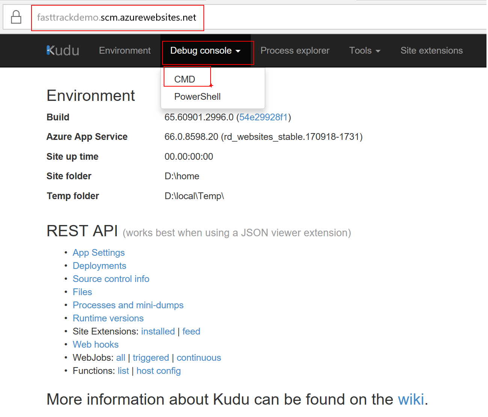

# Digital Marketing POC: Running WordPress on Azure

## Table of Contents
* [Abstract](#abstract)
* [Learning objectives](#learning-objectives)
* [How to install WordPress on Azure Web Apps](#how-to-install-wordpress-on-azure-web-apps) 
* [Configuring WordPress on Azure Web Apps](#configuring-wordpress-on-azure-web-apps)
* [Best Practices for running WordPress on Azure Web Apps](#best-practices-for-running-wordpress-on-azure-web-apps)
* [Creating a sample Post](#creating-a-sample-post)
* [Migrating WordPress Site](#migrating-wordpress-site)
* [WordPress site with MySQL db on IaaS VM](#wordpress-site-with-mysql-db-on-iaas-vm)
* [Adding Custom Domain](#adding-custom-domain)
* [Adding TLS](#adding-tls)
* [Additional Resources](#additional-resources)

## Abstract
Your digital marketing solution allows your organization to engage with customers around the world with rich, personalized digital marketing experiences. Azure provides a scalable, secure, and easy-to-use environment to build your digital marketing sites using WordPress, quickly launch digital campaigns that automatically scale with customer demand, and analyze the effectiveness of those campaigns with data analytics.

## Learning objectives

* Understanding the Azure App Service platform and installing/configuring WordPress on Web Apps
* Implementing various best practices to run WordPress on Azure
* How to migrate your existing WordPress site from on-premises or colo to Azure
* Deploying a WordPress site with a MySQL database on Azure IaaS VMs
* Adding a custom domain to your WordPress site
* Adding TLS (SSL) to your WordPress Site

## How to install WordPress on Azure Web Apps

* Navigate to the Azure Portal
* Click on + New, type WordPress in the search area, press Enter
* Select WordPress, click Create
* Enter an **App name** (example: fasttrackdemo) for your WordPress site, it will validate to make sure the sub domain name is available under azurewebsites.net
* Select your **Subscription**
* For **Resource Group** Create new for this demo (example:fastttackdemo-test-rg)
* For **Database Provider** select **Azure Database for MySQL (Preview)** for this demo
* Select **App Service Plan/Location**, click Create New, enter 
    * App Service Plan: **fastttackdemo-asp**
    * Location: **West US**
    * Pricing tier: **S1 Standard**
* Click **OK**

  
* Select Database, enter
    * Server name: **fasttrackdemo-mysqldbserver**
    * Server admin login name: **your admin user name**
    * Password: **your strong password**
    * Confirm password: **your strong password**
    * Version: **5.7 or latest version**
    * Pricing Tier: **Basic**
        * Compute Units: **50**
        * Storage (GB): **50**
* **OK**

  
* Application Insights: **Off**
* Click **Create**

  

## Configuring WordPress on Azure Web Apps

* Once the WordPress deployment has succeeded, from the left navigation bar in the portal, select **App Services**, then select **fasttrackdemo** web app, then click on the URL: http://fasttrackdemo.azurewebsites.net

  
* This will take you to the initial configuration page: http://fasttrackdemo.azurewebsites.net/wp-admin/install.php. 
* Select **English (United States)** 
* click **Continue**

  
* In the **Information needed** page, enter
    * Site Title: **FastTrack Demo**
    * Username: **your user name**
    * Password: **your strong password**
    * Your Email: **your email address**
* Click on **Install WordPress**

  
* If all goes well you should see a **Success!** page

  
* Click **Login**. Login with the Username & Password provided in the previous step
* This will take you to Dashboard page

  
* To change **Themes**, select **Appearance** then **Themes**. Select **Twenty Sixteen** then click **Activate**

  
* Now visit the site, by selecting **Visit Site** option from top left corner. This will take you to: http://fasttrackdemo.azurewebsites.net/ 
* Your WordPress site should look like this:

  
* Before we add any Posts & Pages, lets configure WordPress with some best practices

## Best Practices for running WordPress on Azure Web Apps

In this section, we will configure WordPress with few best practices.

### **Disable the ARR cookie**
> Azure Websites make great use of the Application Request Routing (ARR) IIS Extension to distribute connections between active instances. ARR helps keep track of users by giving them a special cookie (known as an affinity cookie) that allows Azure Websites to know upon subsequent requests which server instance handled previous requests by the same user. This way, we can be sure that once a client establishes a session with a specific server instance, he will keep talking to the same server as long as the session is active. This is of particular importance for session-sensitive applications (a.k.a. stateful application). Because WordPress is stateless by default and stores all the session information in the database, it does not require clients to connect to the same web server instance. Disabling the ARR cookie will improve performance when running a WordPress site on multiple instances.

To disable the ARR cookie:
* Login to the [Azure portal](http://portal.azure.com/)
* Go to App Services and select you **fasttrackdemo** web app
* Select **Application settings**, find **ARR Affinity** and click **Off**

  
* Click **Save** on the top

### **Azure Blob storage for Media Content**
> If your WordPress site consists of a lot of video and image content, we recommend using blob storage to store all your media content. To learn how to create an Azure storage account, see [How to create an Azure storage account](https://docs.microsoft.com/en-us/azure/storage/common/storage-create-storage-account). Once you have created the account, activate and configure [Windows Azure Storage for WordPress plugin](https://wordpress.org/plugins/windows-azure-storage/) for your WordPress website.

* Make sure to [Create a storage account and a blob container](https://docs.microsoft.com/en-us/azure/storage/common/storage-create-storage-account) first before proceeding to next step. Remark: when creating the container make sure you set the **access level** to **Container** so that users visiting the WordPress site can see the actual media content.
* Once the storage account is created, go to the WordPress site Dashboard page. For example: (http://fasttrackdemo.azurewebsites.net/wp-admin/)
* Click on **Plugins**, then **Add New**
* In the **Search plugins**, enter **Windows Azure Storage for WordPress**
* Click **Install Now**

  
* Once successfully installed, Click **Activate**
* From the WordPress Dashboard page, go to **Settings**, click **Windows Azure**, enter the following:
    * Store Account Name: **your storage account name**
    * Store Account Key: **one of the storage access keys**
    * Use Windows Azure Storage for default upload: **check this box**

  
* Click **Save Changes**
* After clicking save you should see the **Default Storage Container** setting being populated with the container you created when preparing the storage account.
* From now on if you upload any images, audio or video files to your WordPress site (part of your Posts or Pages), they will be uploaded to the Azure storage account automatically instead of being stored in the Web server. You can verify this once you upload an image, by going to your storage account and verify the container contents.

### **Configure Redis cache for WordPress to improve performance**
> You can use Microsoft Azure Redis Cache with a WordPress site to improve performance. Websites that receive massive amounts of user traffic (hundreds of thousands to millions of page views and unique visitors) will benefit from the use of a distributed caching solution such as Redis cache. To setup Redis cache and connect to the WordPress site
 
 * Create Azure [Redis cache from Azure portal](http://azure.microsoft.com/en-us/services/cache/)

    
* After successfully creating Redis cache, note down the **Host Name** & **Primary Access Key**. We will use these values in the following step

  
* Install WordPress **Redis Object Cache** plugin
    * Go to the WordPress site **Dashboard** page
    * Click on **Plugins**, then **Add New**
    * In the **Search plugins**, enter **Redis Object Cache**
    * Click **Install Now**

  
* After installation, make sure to click **Activate**
* Connecting to the Redis cache by updating the **wp-config.php** configuration file
    * To edit the wp-config.php file, go to the Web App Kudu console, by selecting Web App --> search **Kudu** --> **Advanced Tools** --> click **Go**

  
    * Select **Debug console**, then click **CMD**

  
    * In the CMD, navigate to **D:\home\site\wwwroot** folder
    * Edit **wp-config.php**

  
    * Add the following right before **"That's all, stop editing! Happy blogging."**
    
    ```
    /* Redis Cache */
    define('WP_REDIS_SCHEME', 'tcp');
    define('WP_REDIS_HOST', '<your redis account name>.redis.cache.windows.net');
    define('WP_REDIS_PORT', '6379');
    define('WP_REDIS_DATABASE', '0');
    define('WP_REDIS_PASSWORD', '<your primary access key>');
    ```

  
    * Click **Save** on the top
    
* Verify the **Redis Cache** is connected
    * Go to the WordPress site **Dashboard** page
    * Click on **Settings**, then **Redis**
    * Click **Enable Object Cache**
    * Status should be: **Connected**
    
        
* **Other Performance Best practices**: There are only few best practices mentioned above to give you an idea on how to get started. You can find additional best practices using the following resources, keep in mind you may not need all the best practices, select best practices based on your need:

    * [Use Azure CDN for WordPress site on Azure App](https://blogs.msdn.microsoft.com/azureossds/2015/04/27/improving-wordpress-performance-use-azure-cdn/)

    * [How to speed up your WordPress site on Azure App Service](https://azure.microsoft.com/en-us/blog/10-ways-to-speed-up-your-wordpress-site-on-azure-websites/)    

### **Configure CDN for WordPress to improve performance**
Azure CDN can increase the performance and stability of your wordpress blog by caching static content on [edge servers](https://docs.microsoft.com/en-us/azure/cdn/cdn-pop-locations) closer to users. Please see the [Azure CDN Overview](https://docs.microsoft.com/en-us/azure/cdn/cdn-overview) for more details.  

To configure CDN in wordpress, follow these steps:
 1.  [Create an Azure CDN profile](https://docs.microsoft.com/en-us/azure/cdn/cdn-create-new-endpoint) 
 2. [Map a custom domain](https://docs.microsoft.com/en-us/azure/cdn/cdn-map-content-to-custom-domain) such as *cdn.my-company-blog.com* to your CDN profile
 3. Install a CDN plugin 
 4. Configure your CDN plugin to use the custom CDN domain for cached content. Two popular plugins available in the Wordpress plugin repository are [WP Super Cache](https://wordpress.org/plugins/wp-super-cache) and [CDN Enabler](https://wordpress.org/plugins/cdn-enabler).

 WP Super Cache Configuration:
 

 CDN Enabler Configuration:
 

## Creating a sample Post
To create a sample post, follow these steps:

* Go to the WordPress site **Dashboard** page
* Click on **Posts**, then **Add New**
* Enter a **Title** (Example: "FastTrack for Azure Demo post")
* In the **Content** field, enter your post details (Example: "Welcome to the FastTrack for Azure Demo post. One stop shop for Azure onboarding")
* Click on **Add Media** and upload any picture from your machine. Once the picture is uploaded, click on **Insert into post**.
* Finally click on Publish

  
* Your post can be viewed on your home page using a link similar to this: http://fasttrackdemo.azurewebsites.net/

  
* Now if you head over to the Storage Account in the Azure Portal, the image you uploaded as part of your post can be seen under **Storage Account > Blobs > Container > Year folder > month**

  

## Migrating a WordPress Site
To migrate a WordPress site from your on-premises environment or from colo or from another Azure Web App, follow these steps:

There are two main steps involved in migration: 
  1. Copying the WordPress site content (wwwroot directory in the Azure Web App) 
  2. Importing the MySQL database

### Copying WordPress site content
Simply zip your WordPress site content from on-premises. For example if your WordPress site is running on another Azure Web App, using **Kudu > CMD console**, download **wwwroot** directory as zip file.

  
* Next step: import the **wwwroot** directory in to the Azure Web App using the Kudu console. To do this simply drag your content zip file (example:wwwroot.zip) from your desktop folder on to the Kudu console Size column. This will extract the content in that directory.

  

### Importing the MySQL database
* Now export your MySQL database. You can use tools like phpMyAdmin (web interface) or MySQL WorkBench. For example: phpMyAdmin is offered as an Azure Web App site **Extension**. You can install this and use it to export your MySQL db

  
* Next step: import your MySQL database. Again you can use tools like phpMyAdmin (web interface) or MySQL WorkBench. From phpMyAdmin, go to the Import tab, select the MySQL file you exported in the previous step and click Go.

  
* One last step, you may need to go to the **wp_options** table using the phpMyAdmin (web interface) or MySQL WorkBench, to replace the old site URL address with the new site URL address.

  

## WordPress site with MySQL db on IaaS VM
Normally when you create a WordPress site using Azure Web Apps you are presented with an option to select an existing or create a ClearDB MySQL database or Azure Database for MySQL. But what if you don’t want to use an existing instance or create a new one? What if you want to use a MySQL database instance deployed to an Azure VM.

The easiest approach is to create a WordPress site with Azure Web Apps and select either an existing/create new Azure Database for MySQL or ClearDB database. Once the WordPress site is deployed, you can then change the database connection string via **Web App > Application Settings > Connection string** or edit the **wp-config.php** file to be the database you want (e.g. a MySQL instance on an Azure VM). Here are the steps to follow:

* Let the WordPress site be deployed, but do not complete the installation/configuration. In other words, once the site is deployed, browsing to the site’s URL should result in the standard WordPress default installation prompt.

  

There are two ways to update the database connection string:

1. Edit **App Settings Connection string** via the Azure Portal (**Recommended approach**)

    * Using Azure Portal, go to your **Web App > Application Settings > Connection string** 
    * Click on **(hidden for Security)** and update the **DefaultConnection** string with MySQL on IaaS VM values.
         


2. Edit the **wp-config.php** file via Kudu (**not recommended**)
    * Open the Kudu console by going to http:[your-site-name].scm.azurewebsites.net (example: http://fasttrackdemo.scm.azurewebsites.net/)
    * In the CMD prompt, navigate to the **D:\home\site\wwwroot** directory
    * Edit **wp-config.php**
         
    
    * Change the following values: **DB_NAME, DB_USER, DB_PASSWORD, DB_HOST** with MySQL on IaaS VM values. **Important**: as you can see these values are read from Web App's App Settings Connection string instead of being hard coded here. So its recommended to update the App settings. So follow the next method.
          

## Adding a Custom Domain
There are two main steps to add a custom domain to your WordPress site

  1. [Buy a custom domain from Azure and configure your web app](https://docs.microsoft.com/en-us/azure/app-service/custom-dns-web-site-buydomains-web-app) or [Use an existing domain to configure your web app](https://docs.microsoft.com/en-us/azure/app-service/app-service-web-tutorial-custom-domain)
  2. Update the WordPress site to resolve to the new domain

Updating the WordPress site to resolve to the new domain can be done in 2 ways:

  1. Using WordPress dashboard. Update **Settings > General > WordPress Address (URL) & Site Address (URL)**. This might be greyed out and may not allow you to update for multiple reasons (example: updating wp-config.php).

        
  2. Update the database using **phpMyAdmin** extension.  

        * First Install **phpMyAdmin** extension, by going to **WebApp > Extensions > Add phpMyAdmin**

            
        * Once you install **phpMyAdmin** extension, Browse to it. It should take you to phpMyAdmin web interface (for example: https://fasttrackdemo.scm.azurewebsites.net/phpmyadmin/)
        * Expand you MySQL database from left tree and open up **wp-options** table and update two records (Column: **option_value**) where **option_name = siteurl & home**. This value should be your custom domain.

            .

## Adding TLS
To add an SSL certificate binding to your WordPress site, follow these steps:
* [Bind an existing custom SSL certificate to Azure Web Apps](https://docs.microsoft.com/en-us/azure/app-service-web/app-service-web-tutorial-custom-ssl)
* [Buy and Configure an SSL Certificate for your Azure App Service](https://docs.microsoft.com/en-us/azure/app-service-web/web-sites-purchase-ssl-web-site)
* [HTTPS for WordPress](https://make.wordpress.org/support/user-manual/web-publishing/https-for-wordpress/)

## Additional Resources
* [Running WordPress on App Services (Windows/Linux)](https://blogs.msdn.microsoft.com/appserviceteam/2017/09/12/how-to-for-wordpress-on-app-service-windowslinux/)
* [Best Practices for WordPress Security on Azure](https://blogs.msdn.microsoft.com/azureossds/2016/12/26/best-practices-for-wordpress-security-on-azure/)
* [Single Sign On with ADFS/Azure AD/Windows Plugin](https://wordpress.org/plugins/miniorange-windows-single-sign-on/)
