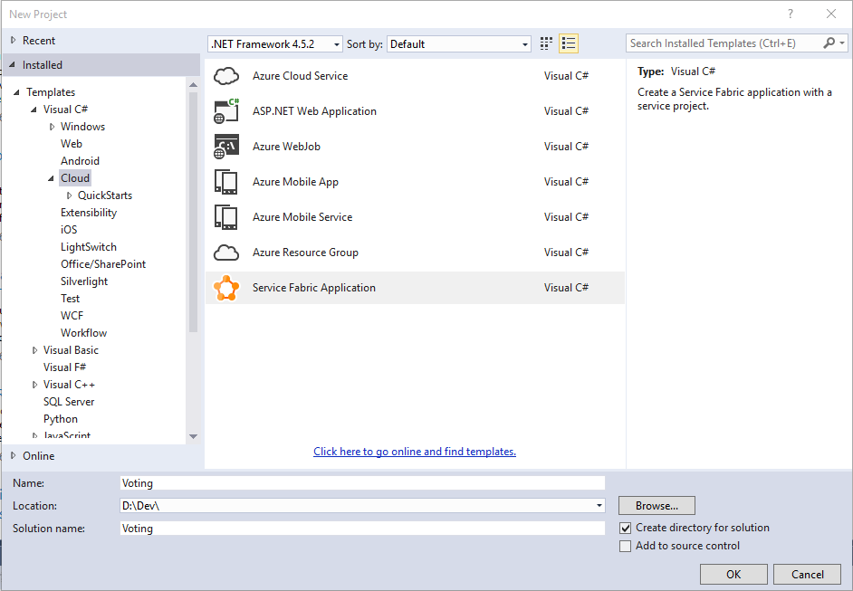
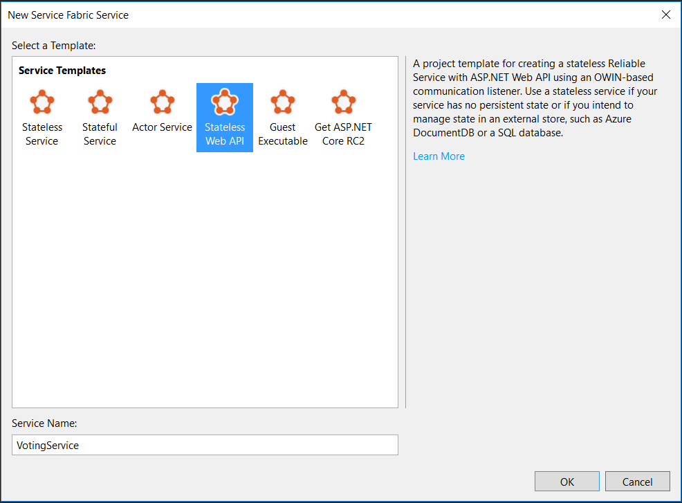
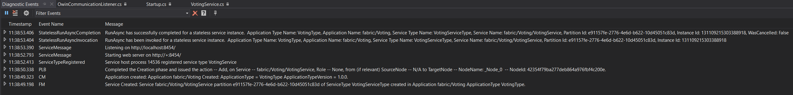
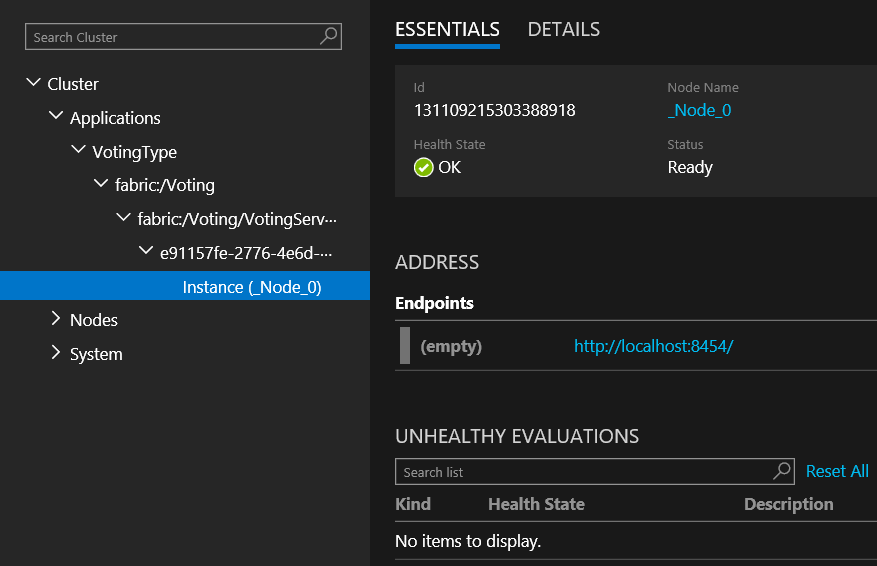
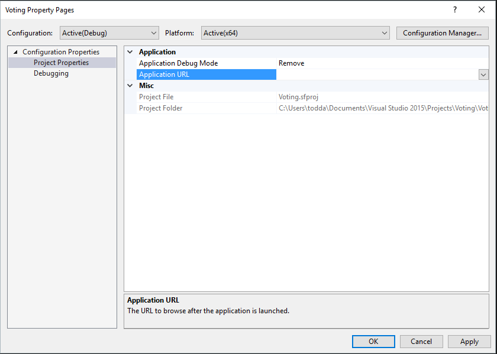
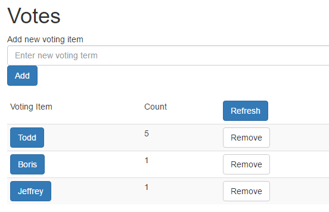

## Create a Stateless service

1.	Open Visual Studio with elevated privileges by pressing the Start ( ) button on the keyboard and typing “Visual Studio”, then run Visual Studio by right clicking and choosing Run as Administrator. Visual Studio must be run using elevated privileges because it must interact with the Service Fabric runtime.
2.	Select File | New | Project …
3.	Go to Cloud and choose Service Fabric Application

 

4.	Enter “Voting” for the Name and Solution name fields and then click OK
5.	In Service Templates choose Stateless Web API and enter “VotingService” for the service name. Click OK.

 
 
6.	Visual Studio will create a solution containing two projects, Voting and VotingService. The Voting project is the Service Fabric project containing:
a.	A reference to the VotingService project
b.	ApplicationPackageRoot folder containing the ApplicationManifest.xml file describing your Service Fabric application
c.	ApplicationParameters folder containing deployment parameters for local (Local.1Node.xm and Local.5Node.xmll) and cloud (Cloud.xml) deployments. In this poc we’ll only use the Local.5Node.xml parameters
d.	PublishProfiles containing deployment profiles for local (Local.1Node.xml and Local.5Node.xml) and cloud (Cloud.xml) deployments. In this poc we’ll only use the Local.5Node.xml profile. The Cloud profile is used to publish to Azure
e.	Scripts containing the scripts used for deploying the application to the cluster
f.	Packages.config used to indicate the packages associated with this application
The VotingService project contains the stateless service implementation and contains:
a.	Controllers folder containing the controllers for this project. An initial controller named ValuesController.cs has been generated
b.	PackageRoot folder containing the service configuration and ServiceManifest.xml
c.	OwinCommunicationsListener.cs contains the ICommunicationListener implementation based on the Owen HTTP hosting framework
d.	Program.cs which is the host executable of the stateless service
e.	ServiceEventSource.cs contains the class used for diagnostic events
f.	Startup.cs containing the application server startup configuration
g.	VotingService.cs contains the classed implementing the stateless voting service
7.	At this point you have a functioning service that can be hosted within Service Fabric. Press F5 to see the service running. Within Visual Studio, the Diagnostic Events panel will be visible and display messages coming from within the application.

 
 
Note: In the 5.3 version of the SDK too many Service Fabric events are being generated and they hide the events that are part of this poc. To disable the extra events, click the gear icon in the diagnostic event window and remove the “Microsoft-ServiceFabric:5:0x4000000000000000” line. Then click Apply.

8.	The deployed application can also be seen in Service Fabric Explorer. On the Service Fabric icon   in the notification area, right click on the icon and choose Manage Local Cluster. The Service Fabric Explorer (SFX) will start in a browser.

Note: If the icon isn’t present, start the Service Fabric Local Cluster Manager by pressing the Start ( ) button on the keyboard and typing “Service Fabric Local Cluster Manager”, then run the application by pressing Enter. This will start the Service Fabric Local Cluster Manager and the Service Fabric icon   will appear in the notification area. If you haven’t already created a cluster, select Start Local Cluster and close 5 node.  
9.	On the left side of SFX fully expand the applications tree. You can see that the application fabric:/Voting has been deployed and contains a single service named fabric:/Voting/VotingService. The service has a single instance that is deployed on a node (_Node_0 in this case). 

10.	Select Instance (_Node_X) where X represent the number displayed. On the right side of SFX, you’ll see more details about the service including the endpoint where it curently resides (http://localhost:8454/ in this example, your port is likelly to be different).  Paste the endpoint there and append “api/values” into a browser address bar. This will return a JSON document containing [“value1”, “value2”], which is the standard behavior of this Visual Studio template.

 
 
11.	Stop the application by exiting the debugger. This will remove the application from Service Fabric.
You have now completed the parts related to having your service replicas listen for HTTP client requests. In the next section, you will add code to process the requests to keep track of the voting items and their counts.

Add Voting Endpoints
The next step is to add some endpoints that can be used to vote and view the votes. We’ve written a single page application for this purpose. 

12.	Right click on the Voting project and select Properties. Remove the Application URL property value and click OK. This will prevent a browser popping up each time we debug. For reference, the Application Debug Mode setting is set to automatically remove the Service Fabric application when debugging is stopped.  
  

13.	In the VotingService project, open the ServiceManifest.xml file which is contained in the PackageRoot folder. Remove Port=”XXXX” from the Endpoint element, where XXXX is the port number assigned. In this example the port number is 8454. This allows Service Fabric to assign a random port for your service.

     Change  
Endpoint Protocol="http" Name="ServiceEndpoint" Type="Input" Port="8454" /
     To           
Endpoint Protocol="http" Name="ServiceEndpoint" Type="Input" /

We’re allowing Service Fabric to assign ports because later in the poc, we’ll run multiple instances of the service on your development box. Without this change, only the first instance will start successfully. Even in production, it’s better to use dynamically assigned ports to avoid port conflicts with other services that may be running on the node except for nodes exposed to the Azure load balancer.

14.	Rename ValuesController.cs  to VotesController.cs. If prompted to rename the class, select Yes. Ensure the class name ValuesController has been changed to VotesController.
15.	Add a new class to the VotingService project called “HtmlMediaFormatter.cs” and paste the following contents within the namespace brackets. Remove extra using directives at the top of the file if necessary.

    using System;
    using System.IO;
    using System.Text;
    using System.Net.Http;
    using System.Net.Http.Headers;
    using System.Net.Http.Formatting;

    // This class is needed to be able to return static files from the WebAPI 2 self-host infrastructure.
    // It will return the index.html contents to the browser.
    public class HtmlMediaFormatter : BufferedMediaTypeFormatter
    {
        public HtmlMediaFormatter()
        {
            SupportedMediaTypes.Add(new MediaTypeHeaderValue("text/html"));
            SupportedEncodings.Add(new UTF8Encoding(encoderShouldEmitUTF8Identifier: false));
        }

        public override bool CanReadType(Type type)
        {
            return false;
        }

        public override bool CanWriteType(Type type)
        {
            return (typeof(string) == type) ? true : false;
        }

        public override void WriteToStream(Type type, object value, Stream writeStream, HttpContent content)
        {
            Encoding effectiveEncoding = SelectCharacterEncoding(content.Headers);

            using (var writer = new StreamWriter(writeStream, effectiveEncoding))
            {
                writer.Write(value);
            }
        }
    }

16.	 Open Startup.cs and replace the contents of the ConfigureApp method with the following code

            // Configure Web API for self-host. 
            HttpConfiguration config = new HttpConfiguration();

            config.MapHttpAttributeRoutes();			// NEW
            config.Formatters.Add(new HtmlMediaFormatter());  // NEW

            config.Routes.MapHttpRoute(
                name: "DefaultApi",
                routeTemplate: "api/{controller}/{id}",
                defaults: new { id = RouteParameter.Optional }
            );

        appBuilder.UseWebApi(config);

17.	Add a new HTML file to the VotingService project named “index.html”. This is the Angular Single Page Application (SPA) HTML file that displays the user experience and communicates with the service’s REST API. Explaining more about using Angular is beyond the scope of this poc. Paste the following contents:

<!DOCTYPE html>
<html lang="en" xmlns="http://www.w3.org/1999/xhtml" ng-app="VotingApp" xmlns:ng="http://angularjs.org">
<head>
    <meta charset="utf-8" />
    <meta content="IE=edge, chrome=1" http-equiv="X-UA-Compatible" />
    <meta name="viewport" content="width=device-width, initial-scale=1, maximum-scale=1" />

    <!-- Stylesheets -->
    <link href="http://maxcdn.bootstrapcdn.com/bootstrap/3.3.4/css/bootstrap.min.css" rel="stylesheet">

    <!-- Application title and icons -->
    <title>Voting Service Poc Sample</title>

    <!-- IE Fix for HTML5 Tags -->
    <!--[if lt IE 9]>
      
    <![endif]-->

</head>
<body ng-controller="VotingAppController">
    

        <h1>Votes</h1>
        

            Add new voting item <input id="txtAdd" type="text" class="form-control" placeholder="Enter new voting term" ng-model="item" />
            <button id="btnAdd" class="btn btn-primary" ng-click="add(item)">Add</button>
        

         
        <table class="table table-striped table-condensed table-hover">
            <thead>
                <tr>
                    <td>Voting Item</td>
                    <td>Count</td>
                    <td><button id="btnRefresh" class="btn btn-primary" ng-click="refresh()">Refresh</button></td>
                </tr>
            </thead>
            <tr ng-repeat="vote in votes">
                <td><button class="btn btn-primary" ng-click="add(vote.Key)">{{vote.Key}}</button></td>
                <td>{{vote.Value}}</td>
                <td><button class="btn btn-default" ng-click="remove(vote.Key)">Remove</button></td>
            </tr>
        </table>
    

    <!-- 3rd party libraries -->
    
    
    
    
    
    
    
    

    <!-- Load application main script -->
    
</body>
</html>

18.	Right click on index.html and select Properties (Alt+Enter). In the properties windows change the property Copy to Output Directory to Copy Always.
19.	Open VotesController.cs and paste the following implementation within the namespace brackets. Remove extra using directives at the top of the file. Note that the hardcoded path is version specific. When the version is changed later in the poc, the file will no longer be at this location.

    using System;
    using System.Collections.Generic;
    using System.IO;
    using System.Net;
    using System.Net.Http;
    using System.Threading;
    using System.Net.Http.Headers;
    using System.Web.Http;

    public class VotesController : ApiController
    {
        // Used for health checks.
        public static long _requestCount = 0L;

        // Holds the votes and counts. NOTE: THIS IS NOT THREAD SAFE FOR THE PURPOSES OF THE POC ONLY.
        static Dictionary<string, int> _counts = new Dictionary<string, int>();

        // GET api/votes 
        [HttpGet]
        [Route("api/votes")]
        public HttpResponseMessage Get()
        {
            Interlocked.Increment(ref _requestCount);

            List<KeyValuePair<string, int>> votes = new List<KeyValuePair<string, int>>(_counts.Count);
            foreach(KeyValuePair<string, int> kvp in _counts)
            {
                votes.Add(kvp);
            }

            var response = Request.CreateResponse(HttpStatusCode.OK, votes);
                response.Headers.CacheControl = new CacheControlHeaderValue() { NoCache = true, MustRevalidate = true };
                return response;
        }

        [HttpPost]
        [Route("api/{key}")]
        public HttpResponseMessage Post(string key)
        {
            Interlocked.Increment(ref _requestCount);

            if (false == _counts.ContainsKey(key))
            {
                _counts.Add(key, 1);
            }
            else
            {
                _counts[key] = _counts[key] + 1;
            }

            return Request.CreateResponse(HttpStatusCode.NoContent);
        }

        [HttpDelete]
        [Route("api/{key}")]
        public HttpResponseMessage Delete(string key)
        {
            Interlocked.Increment(ref _requestCount);

            if (true == _counts.ContainsKey(key))
            {
                if (_counts.Remove(key))
                    return Request.CreateResponse(HttpStatusCode.OK);
            }

            return Request.CreateResponse(HttpStatusCode.NotFound);
        }

        [HttpGet]
        [Route("api/{file}")]
        public HttpResponseMessage GetFile(string file)
        {
            string response = null;
            string responseType = "text/html";

            Interlocked.Increment(ref _requestCount);

            // Validate file name.
            if ("index.html" == file)
            {
                // This hardcoded path is only for the poc. Later in the poc when the version is changed, this
                // hardcoded path must be changed to use the UX. In part 2 of the poc, this will be calculated
                // using the connected service path.
                string path = string.Format(@"..\VotingServicePkg.Code.1.0.0\{0}", file);
                response = File.ReadAllText(path);
            }

            if (null != response)
                return Request.CreateResponse(HttpStatusCode.OK, response, responseType);
            else
                return Request.CreateErrorResponse(HttpStatusCode.NotFound, "File");
        }
    }

20.	Press F5 to enter debug mode. After the solution has been deployed locally there are two ways to determine the endpoint to browse to

a.	In the Diagnostic Events window which should be open within Visual Studio, there will be an event named “ServiceMessage” with a message body containing the base URL the service is listening on, e.g. “Listening on http://localhost:34001”. If the Diagnostic Events windows is not open, it can be opened in Visual Studio by selecting View then Other Windows then Diagnostic Events.

b.	Open Service Fabric Explorer (SFX), navigate to the instance and view the Endpoints properties as described in step 10.

Note: In the 5.3 version of the SDK too many Service Fabric events are being generated and they hide the events that are part of this poc. To disable the extra events, click the gear icon in the diagnostic event window and remove the “Microsoft-ServiceFabric:5:0x4000000000000000” line. 
When you have determined the correct base URI, browse to <base URI>/api/index.html. This will show the single page app just created, except without the data. Try it out. If you want to see that it is calling the services, you can place breakpoints in the VotesController class.

 
21.	When done using the application, exit the debugging session by selecting Debug then Stop Debugging (Shift+F5). This will uninstall the application from Service Fabric and if viewing in Service Fabric Explorer (SFX) you will see that it is no longer deployed.
