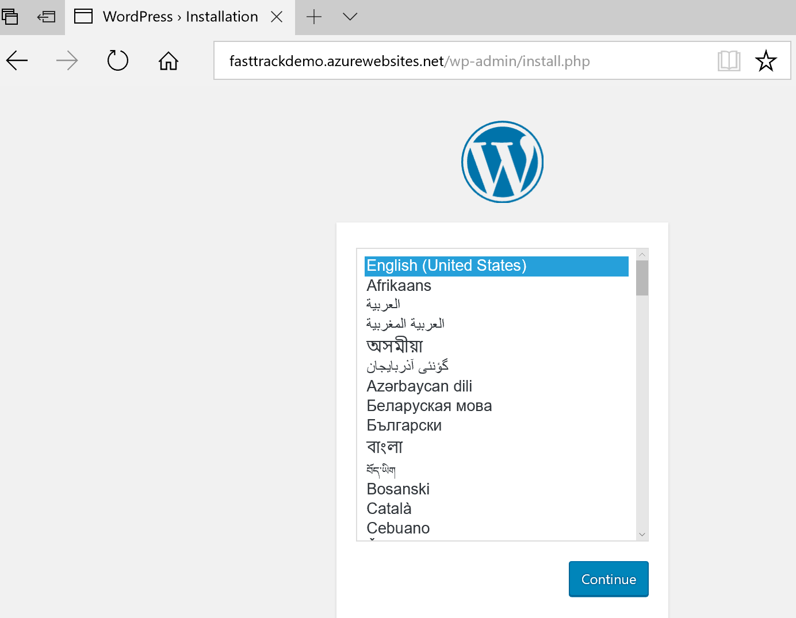
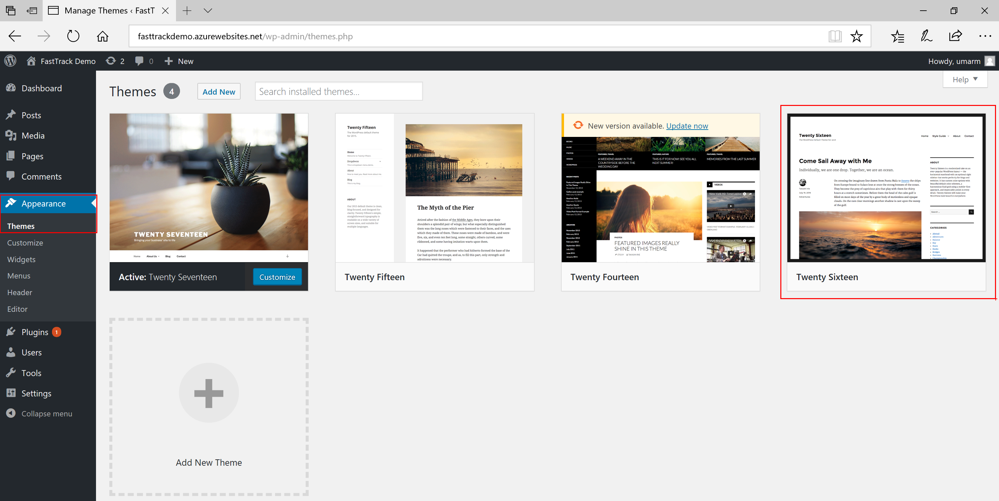

# POC Scenario: Running WordPress on Azure

## Table of Contents

<!-- * [Introduction](#Introduction) -->
* [Abstract](#Abstract)
* [Learning objectives](#Learning-objectives)
* [How to install WordPress on Azure WebApps](#How-to-install-WordPress-on-Azure-WebApps) 
* [Configuring WordPress on Azure WebApps](#Configuring-WordPress-on-Azure-WebApps)
* [Best Practices for running WordPress on Azure WebApps](#Best-Practices-for-running-WordPress-on-Azure-WebApps)
* [Migrating WordPress Site](#Migrating-WordPress-Site)
* [Optional: WordPress site with MySQL db on IaaS VM](#Optional:-WordPress-site-with-MySQL-db-on-IaaS-VM)
* [Optional: Adding Custom Domain](#Optional:-Adding-Custom-Domain)
* [Optional: Adding TLS](#Optional:-Adding-TLS)

<!-- ## Introduction -->

#### Abstract
Your digital marketing solution allows your organization to engage with customers around the world with rich, personalized digital marketing experiences. Azure provides a scalable, secure, and easy-to-use environment to build your digital marketing sites using WordPress, quickly launch digital campaigns that automatically scale with customer demand, and analyze the effectiveness of those campaigns with data analytics.

#### Learning objectives

* Understanding Azure App Service platform and installing/configuring WordPress on Web Apps
* Implementing various best practices to run WordPress on Azure
* How to migrate your existing WordPress site from on-premises or colo to Azure
* Deploying WordPress site with MySQL database on Azure IaaS VMs
* Adding custom domain to your WordPress site
* Adding TLS (SSL) to your WordPress Site

#### How to install WordPress on Azure WebApps

* Navigate to Azure Portal
* Click on + New, type WordPress in the search area, press Enter
* Select WordPress, click Create
* Enter **App name** (example: fasttrackdemo) for your WordPress site, it will validate to make sure the sub domain name available under azurewebsites.net
* Select your **Subscription**
* For **Resource Group** Create new for this demo (example:fastttackdemo-test-rg)
* For **Database Provider** select **Azure Database for MySQL (Preview)** for this demo
* Select **App Service Plan/Location**, click Create New, enter 
    * App Service Plan: **fastttackdemo-asp**
    * Location: **West US**
    * Pricing tier: **S1 Standard**
    * Click **OK**
    * 

* Select Database, etner
    * Server name: **fasttrackdemo-mysqldbserver**
    * Server admin login name: **your admin user name**
    * Password: **your strong password**
    * Confirm password: **your strong password**
    * Version: **5.7 or latest version**
    * Pricing Tier: **Basic**
        * Compute Units: **50**
        * Stroage (GB): **50**
    * **OK**
    * 

* Application Insights: **Off**

* Click **Create** 
* 

#### Configuring WordPress on Azure WebApps

* Once the WordPress deployment succeeded, from the left navigation bar in the portal, select **App Services**, then select **fasttrackdemo** web app, then click on the URL: http://fasttrackdemo.azurewebsites.net
    * 

* This will take you to the initial configuration page:  http://fasttrackdemo.azurewebsites.net/wp-admin/install.php. Select **English (United States)** click **Continue**
    * 

* In the next Information needed page, enter
    * Site Title: **FastTrack Demo**
    * Username: **your user name**
    * Password: **your strong password**
    * Your Email: **your email address**
    * Click on **Install WordPress**
    * 

* If all goes well you should see **Success!** page
    * 

* Click **Login**. Login with Username & Password created in the previous step

* This will take you to Dashboard page
    * 

* To change **Themes**, select **Appearance** then **Themes**. Select **Twenty Sixteen** then click **Activate**
    * 

* Now visit the site, by selecting **Visit Site** option from top left corner. This will take you to: http://fasttrackdemo.azurewebsites.net/ 

* Your WordPress site should look like this:
    * 

* Before we add any Posts & Pages, lets configure WordPress with some best practices

#### Best Practices for running WordPress on Azure WebApps

In this section, we will configure WordPress with few best practices.

* **Disable ARR cookie**: Azure Websites makes great use of the Application Request Routing IIS Extension to distribute connections between active instances. ARR helps keep track of users by giving them a special cookie (known as an affinity cookie) that allows Azure Websites to know upon subsequent requests which server instance handled previous requests by the same user. This way, we can be sure that once a client establishes a session with a specific server instance, he will keep talking to the same server as long as his session is active. This is of particular importance for session-sensitive applications (a.k.a. state full application). Because WordPress is stateless by default and stores all the session information in the database, it does not require clients to connect to the same web server instance. Disabling the ARR cookie will improve performance when running a WordPress site on multiple instances.
To disable ARR cookie:
    * Login to the [Azure portal](http://portal.azure.com/)
    * Go to App Services and select you **fasttrackdemo** web app
    * Select **Application settings**, find **ARR Affinity** and click **Off**
    * 
    * Click **Save** on the top

* **Azure Blob storage for Media Content**: If your WordPress site is heavy with Video and Images content, we recommend using a blob storage to store all your media content. To learn to create an Azure Storage account, see [How to create an Azure Storage account](https://docs.microsoft.com/en-us/azure/storage/common/storage-create-storage-account). Once you have created the account, activate and configure [Windows Azure Storage for WordPress plugin](https://wordpress.org/plugins/windows-azure-storage/) for your WordPress website.
    * Make sure to create Storage Account and a Blob Container 
    * Go to WordPress site Dashboard page. For example: (http://fasttrackdemo.azurewebsites.net/wp-admin/)
    * Click on **Plugins**, then **Add New**
    * In the **Search plugins**, enter **Windows Azure Storage for WordPress**
    * Click **Install Now**
    * 
    * Once successfully installed, Click **Activate**
    * From WordPress Dashboard page, go to **Settings**, click **Windows Azure**, enter the following:
        * Store Account Name: **your storage account name**
        * Store Account Key: **one of the storage access key**
        * Use Windows Azure Storage for default upload: **check this box**
        * 
        * Click **Save Changes**
        * From now on if you upload any Images, Audio or Video files to your WordPress site (part of your Posts or Pages), it will be uploaded to Azure Stroage account automatically instead of being stored in Web server. You can verify this once you upload any image, by going to your Storage account, Blob container.

#### Migrating WordPress Site

#### Optional: WordPress site with MySQL db on IaaS VM

#### Optional: Adding Custom Domain

#### Optional: Adding TLS
