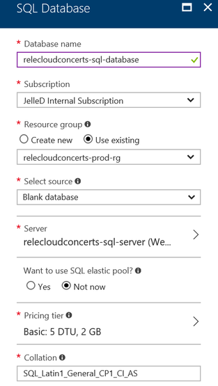
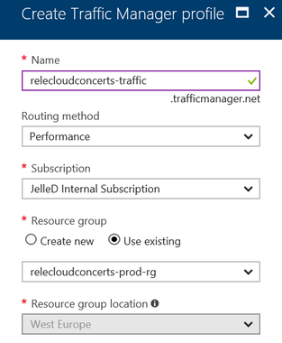

# POC Scenario: E-commerce Website

## Table Of Contents

* [Introduction](#introduction)
  * [Abstract](#abstract)
  * [Learning objectives](#learning-objectives)
* [Preparation](#preparation)
  * [Prerequisites](#prerequisites)
  * [Plan your deployment](#plan-your-deployment)
  * [Open the application with Visual Studio](#open-the-application-with-visual-studio)
* [Deployment Steps - Core Services](#deployment-steps---core-services)
  * [Create an Azure Resource Group](#create-an-azure-resource-group)
  * [Deploy the Web App](#deploy-the-web-app)
  * [Create the SQL Database containing the concerts](#create-the-sql-database-containing-the-concerts)
  * [Enable user sign-in via Azure AD B2C](#enable-user-sign-in-via-azure-ad-b2c)
  * [Set up Azure Search connected to the SQL Database](#set-up-azure-search-connected-to-the-sql-database)
  * [Enable background ticket image generation via a Function App](#enable-background-ticket-image-generation-via-a-function-app)
* [Deployment Steps - Optional Services](#deployment-steps---optional-services)
  * [Add caching of upcoming concerts using Redis Cache](#add-caching-of-upcoming-concerts-using-redis-cache)
  * [Set up monitoring and analytics using Application Insights](#set-up-monitoring-and-analytics-using-application-insights)
  * [Add sentiment analysis for reviews using Cognitive Services](#add-sentiment-analysis-for-reviews-using-cognitive-services)
  * [Prepare the web app for global availability using Traffic Manager](#prepare-the-web-app-for-global-availability-using-traffic-manager)
* [Next Steps](#next-steps)
  * [Deploy using an ARM Template](#deploy-using-an-arm-template)
  * [Add social logins](#add-social-logins)
  * [Improve the search experience](#improve-the-search-experience)
  * [Add multiple web app instances](#add-multiple-web-app-instances)

## Introduction

#### Abstract
Azure Platform-as-a-Service (PaaS) enables you to deploy enterprise grade e-commerce applications, and lets you adapt to the size and seasonality of your business. When demand for your products or services takes off — predictably or unpredictably — you can be prepared to handle more customers and more transactions automatically. Additionally, take advantage of cloud economics by paying only for the capacity you use. In short, focus on your sales and leave the infrastructure management to your cloud provider.

During this guided Proof-Of-Concept (POC) scenario, you will learn about bringing together various Azure PaaS components to deploy a sample e-commerce application, _Relecloud Concerts_, an online concert ticketing platform.

#### Learning objectives
* Understanding the Azure App Service platform and building Web Apps with SQL Database
* Implementing search, user sign-up, background task processing, and caching
* Gaining insights into application and user behavior with Application Insights
* Implementing continuous integration and continuous deployment workflows for your application 

## Preparation

#### Prerequisites
To complete this scenario, you will need:
* Visual Studio 2017 Update 3 or later with the "Azure development" features
* [ASP.NET Core 2.0](https://www.microsoft.com/net/core)
* An Azure subscription

#### Plan your deployment
* As part of this scenario, you will be deploying the following resources into a Resource Group:
  * App Service
  * Function App
  * Application Insights
  * Redis Cache
  * Search Service
  * SQL Database
  * Storage Account
  * Cognitive Services
  * Traffic Manager
* When choosing names for your resources, try to follow a **standard naming pattern**, e.g. by following the [naming conventions documented on the Azure Architecture Center](https://docs.microsoft.com/en-us/azure/architecture/best-practices/naming-conventions)
  * To make it easier, we'll provide suggestions based on a naming prefix of your choosing, referred to as `<prefix>` from this point onwards
  * To ensure that your deployment does not conflict with other Azure customers, use a prefix that is unique to your organization
  * To ensure that your chosen prefix can be used for all resource types, use a relatively short name consisting only of lowercase letters (no digits, no other special characters) e.g. `contoso`
* Choose an **Azure region** to host your deployment
  * You can choose any supported region, but for performance and cost reasons it's recommended to keep all resources in the same region whenever possible
  * You can see the availability of all [Azure services by region](https://azure.microsoft.com/en-us/regions/services/) to determine the best location
  * For this scenario, choose a region where **Application Insights** (under the **Developer Tools** category in the link above) is available, as it is not currently present in all regions
* Whenever there could be multiple instances of the same type of resource in multiple regions (e.g. for a globally distributed web application that has an App Service in multiple regions), consider including an abbreviation of the region in the resource name
  * E.g. `eu` for East US or `we` for West Europe
  * We will refer to this as `<region>` in the suggested names below
* At the end your Resource Group may look something like this:

#### Open the application with Visual Studio
* Clone the repository or copy the project's [source code](../src) to a local working folder
* From the working folder, open **Relecloud.sln** with Visual Studio
* 
* Explore the solution
  * The `Relecloud.Web` project contains the main e-commerce web application
    * This will be deployed as an Azure Web App
    * Especially the `Startup.cs` file is important as it contains the logic to hook up the necessary services based on the configuration
    * If a configuration setting is missing for a certain Azure service, it  will be replaced by a dummy implementation so you can build up the solution gradually without running into errors
  * The `Relecloud.FunctionApp` project contains functions to perform background event processing
    * This will be deployed as an Azure Function App

## Deployment Steps - Core Services

#### Create a Resource Group
> This allows you to group all the Azure resources mentioned above in a single container for easier management

* Navigate to the [Azure Portal](https://portal.azure.com) and sign in with your account
* [Create a Resource Group](https://docs.microsoft.com/en-us/azure/azure-resource-manager/resource-group-portal)
  * _Suggested name for the Resource Group: `<prefix>-prod-rg`_
  * 

#### Deploy the Web App
> This allows users to visit your e-commerce web application

* Build the `Relecloud.Web` project (e.g. in Visual Studio or on the command line) and ensure there are no errors
* Use any of the supported ways to [deploy the project to Azure App Service](https://docs.microsoft.com/en-us/azure/app-service-web/web-sites-deploy)
  * Note that the easiest way if you are using Visual Studio is to [publish the project directly to Azure](https://docs.microsoft.com/en-us/azure/app-service-web/app-service-web-get-started-dotnet#publish-to-azure)
* When creating the App Service:
  * _Suggested name for the App Service: `<prefix>-web-app-<region>`_
  * _Suggested name for the App Service Plan: `<prefix>-web-plan-<region>`_
  * Ensure to create the App Service Plan in the Resource Group you created before
  * Ensure to create the App Service Plan in the same Azure region as the Resource Group
  * Choose `S1 Standard` or higher as the pricing tier for the App Service Plan (lower pricing tiers do not support Traffic Manager which we can use later on)
  * 
* After the deployment is complete, browse to the site at `http://<your-site-name>.azurewebsites.net`
  * You should be able to navigate around the site but there will not be any concerts and signing in will not work

#### Create the SQL Database containing the concerts
> This allows the stateless web application to store persistent data in a managed database service

* Back in the Azure Portal, navigate to the Resource Group and [create a SQL Database](https://docs.microsoft.com/en-us/azure/sql-database/sql-database-get-started-portal)
  * _Suggested name for the SQL Database: `<prefix>-sql-database`_
  * Choose `Basic` or higher as the pricing tier for the SQL Database
  * 
  * _Suggested name for the SQL Server: `<prefix>-sql-server`_
  * Ensure to create the firewall rule that allows Azure services to access the server
  * 
* After the SQL Database has been created, navigate to its **Connection strings** blade in the Azure Portal and copy the **ADO.NET connection string** to the clipboard
* Navigate to the App Service for the Web App and open the **Application settings** blade
  * Under **App settings** (note: _do not_ use **Connection strings**), add a new configuration setting:

Name | Value
---- | -----
App:SqlDatabase:ConnectionString | The connection string you copied before (with the user name and password placeholders replaced with their actual values)

* Browse to the site again and click **Upcoming**, it should now be showing a few upcoming concerts
  * This is because when you configured the connection string in the web app, it caused a restart of the application - at which point it automatically initializes the database with the right schema and a few sample concerts

#### Enable user sign-in via Azure AD B2C
> This allows new users to sign up for your e-commerce application and to manage their profiles

* Go back to your Resource Group in the Azure Portal and [create a new Azure Active Directory B2C tenant](https://docs.microsoft.com/en-us/azure/active-directory-b2c/active-directory-b2c-get-started)
  * Ensure to create a _new_ tenant, not to link an existing one
  * 
  * After the Azure AD B2C tenant is created, copy the full domain name from the **Overview** blade (e.g. `relecloudconcerts.onmicrosoft.com`) and paste it in Notepad for later
  * Please note, remember to do a full browser refresh. This will ensure you can see the new Azure AD tenant you created when you click on your profile in the top right hand corner
* [Register the web application in the Azure AD B2C tenant](https://docs.microsoft.com/en-us/azure/active-directory-b2c/active-directory-b2c-app-registration)
  * Follow the steps to register a **web app**
  * For the **Name** (which will be seen by users when they sign in), use `Relecloud Concerts`
  * For the **Reply URL**, use `https://<your-site-name>.azurewebsites.net/signin-oidc`
    * Note that this URL must be secure (i.e. it must use **https**)
    * Fortunately Azure App Service provides a valid SSL certificate for the `*.azurewebsites.net` domain out of the box
  * 
* After the application is registered, open its **Properties** blade
  * Copy the **Application ID** to Notepad
* Go back to the Azure AD B2C **Applications** blade to create the necessary policies
* Create a combined [sign-up or sign-in policy](https://docs.microsoft.com/en-us/azure/active-directory-b2c/active-directory-b2c-reference-policies#create-a-sign-up-or-sign-in-policy)
  * For the policy **Name**, use `SignUpOrIn`
  * For the **Sign-up attributes**, select at least `Display Name` and `Email Address`
  * For the **Application claims**, select at least `Display Name`, `Email Addresses` and `User's Object ID`
  * 
  * After the policy is created, copy its full name to Notepad (including the `B2C_1_` prefix that is automatically appended)
* Create a [profile editing policy](https://docs.microsoft.com/en-us/azure/active-directory-b2c/active-directory-b2c-reference-policies#create-a-profile-editing-policy)
  * For the policy **Name**, use `EditProfile`
  * For the **Profile attributes**, select at least `Display Name` so the user can edit their name as it is displayed in the web application
  * For the **Application claims**, select at least `Display Name`, `Email Addresses` and `User's Object ID`
  * After the policy is created, copy its full name to Notepad (including the `B2C_1_` prefix that is automatically appended)
* Create a [password reset policy](https://docs.microsoft.com/en-us/azure/active-directory-b2c/active-directory-b2c-reference-policies#create-a-password-reset-policy)
  * For the policy **Name**, use `ResetPassword`
  * For the **Application claims**, select at least `Display Name`, `Email Addresses` and `User's Object ID`
  * After the policy is created, copy its full name to Notepad (including the `B2C_1_` prefix that is automatically appended)
* Navigate to the App Service for the Web App and open the **Application settings** blade
  * Under **App settings**, add the following new configuration settings from the values in Notepad:

Name | Value
---- | -----
App:Authentication:Tenant | The full domain name of your Azure AD B2C tenant (including `.onmicrosoft.com`)
App:Authentication:ClientId | The Client ID of the web app you registered
App:Authentication:SignUpSignInPolicyId | The name of the sign-up or sign-in policy, e.g. `B2C_1_SignUpOrIn`
App:Authentication:EditProfilePolicyId | The name of the profile editing policy, e.g. `B2C_1_EditProfile`
App:Authentication:ResetPasswordPolicyId | The name of the password reset policy, e.g. `B2C_1_ResetPassword`

* Browse to the site again, it should now allow you to register as a new user
  * Go through the sign in experience to register a new account using any email address (e.g. use a personal email to simulate an end user for your e-commerce application)
  * Notice that once you are signed in, the application will display your name and clicking it will allow you to change your profile stored in Azure AD B2C (i.e. the profile editing policy)
  * When signing in again later, also notice that there is a possibility to reset your password in case you forgot it (i.e. the password reset policy)
  * Important to note is that **no user credentials are ever stored or managed in the application database**: the complete identity management experience is handled and secured by Azure AD B2C
  * Also note that it is possible to completely [customize the user experience presented by Azure AD B2C](https://docs.microsoft.com/en-us/azure/active-directory-b2c/active-directory-b2c-ui-customization-custom) (e.g. to use custom branding images or a completely new look to match the style of your web application)

#### Set up Azure Search connected to the SQL Database
> This allows your users to perform powerful searches for the concerts in the database with hit highlighting

* Go back to your Resource Group in the Azure Portal and [create a new Azure Search Service](https://docs.microsoft.com/en-us/azure/search/search-create-service-portal)
  * _Suggested name for the service name: `<prefix>-search`_
  * Choose `Basic` or higher as the pricing tier
  * 
  * After the Azure Search service has been created, navigate to the **Keys** blade and copy the **Primary admin key** to the clipboard
* Navigate to the App Service for the Web App and open the **Application settings** blade
  * Under **App settings**, add the following new configuration settings:

Name | Value
---- | -----
App:AzureSearch:ServiceName | The name of the Azure Search service (not the full DNS name)
App:AzureSearch:AdminKey | The primary admin key you copied before

* Browse to the site again; within a few minutes it should now allow you to search for concerts and highlight the matching text in the search results

* Note that the configuration of the connection (the "[indexer](https://docs.microsoft.com/en-us/azure/search/search-howto-connecting-azure-sql-database-to-azure-search-using-indexers)") between the SQL Database (the "data source") and the Azure Search service (the "[index](https://docs.microsoft.com/en-us/azure/search/search-what-is-an-index)") is performed automatically by the application upon startup when configured with the settings you just added
* Browse through the blade for the Azure Search service you just created in the portal
  * Open the **index** to see which fields are maintained in the search index
  * Open the **data source** to see the connection to SQL Database that is used to keep the index up to date with any changes to the concert data
  * Open the **indexers** to see when the data was last indexed

#### Enable background ticket image generation via a Function App
> This allows users to get a printable ticket with a barcode when they purchase tickets

* Go back to your Resource Group in the Azure Portal and [create a new Storage Account](https://docs.microsoft.com/en-us/azure/storage/common/storage-create-storage-account#create-a-storage-account)
  * _Suggested name for the Storage Account: `<prefix>storage`_ (note that special characters are not allowed here)
  * The Queues service will be used to send an event to a background application whenever a user purchases a ticket
  * The Blobs service will be used to securely store the generated ticket images
  * 
  * After the Storage Account has been created, navigate to the **Access keys** blade and copy the **connection string** for **key1** to the clipboard
* Navigate to the App Service for the Web App and open the **Application settings** blade
  * Under **App settings**, add the following new configuration settings:

Name | Value
---- | -----
App:StorageAccount:ConnectionString | The connection string you copied before
App:StorageAccount:EventQueueName | A name for the queue through which event messages will be sent, e.g. `events`

* Build the `Relecloud.FunctionApp` project (e.g. in Visual Studio or on the command line) and ensure there are no errors
* Use any of the supported ways to [deploy the project to an Azure Function App](https://docs.microsoft.com/en-us/azure/azure-functions/functions-infrastructure-as-code)
  * Note that the easiest way if you are using Visual Studio 2017 or above is to [publish the project directly to Azure](https://docs.microsoft.com/en-us/azure/azure-functions/functions-develop-vs#publish-to-azure)
  * If the **Azure Function App** option is missing from the publishing targets you might need to install an update for the **Azure Functions and Web Job Tools** Visual Studio extension. You should see a notification flag in the upper right corner which will allow you to update the extension.
* When creating the Function App:
  * _Suggested name for the App Service: `<prefix>-func-app`_
  * _Suggested name for the App Service Plan: `<prefix>-func-plan`_
  * Ensure to create the App Service Plan in the Resource Group you created before
  * Ensure to create the App Service Plan in the same Azure region as the Resource Group
  * Choose `Consumption` as the pricing tier for the App Service Plan so you only pay when the function is effectively running (use another pricing tier if this is not supported in your chosen Azure region)
  * Choose the Storage Account you created before to store the required function app state
  * 
* Navigate to the Function App in the Azure Portal and open the **Application settings** tab
  * Under **Application settings**, add the following new configuration settings:

Name | Value
---- | -----
App:StorageAccount:ConnectionString | The same as in the Web App
App:StorageAccount:EventQueueName | The same as in the Web App
App:SqlDatabase:ConnectionString | The same as in the Web App

* Browse to the site again and purchase some tickets
  * At first, the tickets page should be showing a message that the ticket is still being generated
  * The ticket image will be generated in the background by the Function App (triggered by a message in a queue), stored into blob storage, at which point the ticket in the database will be updated with a URL to the image (secured by a [Shared Access Signature](https://docs.microsoft.com/en-us/azure/storage/common/storage-dotnet-shared-access-signature-part-1))
  * After a little while, a ticket image should appear when you refresh the tickets page

## Deployment Steps - Optional Services

#### Add caching of upcoming concerts using Redis Cache
> This increases the performance of the most visited page of the web application by keeping the list of upcoming concerts in a memory cache for fast retrieval

* Go back to your Resource Group in the Azure Portal and [create a new Redis Cache](https://docs.microsoft.com/en-us/azure/redis-cache/cache-dotnet-how-to-use-azure-redis-cache#create-cache)
  * _Suggested name for the DNS name: `<prefix>-redis`_
  * Choose `Basic C0` or higher as the pricing tier
  * 
  * After the Redis Cache has been created, navigate to the **Access keys** blade and copy the **Primary connection string (StackExchange.Redis)** to the clipboard
* Navigate to the App Service for the Web App and open the **Application settings** blade
  * Under **App settings** (note: _do not_ use **Connection strings**), add a new configuration setting:

Name | Value
---- | -----
App:RedisCache:ConnectionString | The connection string you copied before

* Browse to the site again, it should now be showing the same upcoming concerts page (with improved performance if at all noticeable)

#### Set up monitoring and analytics using Application Insights
> This allows you to get insights on user and application behavior

* Go back to your Resource Group in the Azure Portal and [create a new Application Insights resource](https://docs.microsoft.com/en-us/azure/application-insights/app-insights-create-new-resource)
  * _Suggested name for the Application Insights resource: `<prefix>-appinsights`_
  * 
  * After the Application Insights resource has been created, navigate to the **Properties** blade and copy the **Instrumentation Key** to the clipboard
* Navigate to the App Service for the Web App and open the **Application settings** blade
  * Under **App settings**, add the following new configuration setting:

Name | Value
---- | -----
ApplicationInsights:InstrumentationKey | The instrumentation key you copied before

* Browse to the site again and visit a few pages
  * This should start flowing data into Application Insights in the background
* Go to the **Overview** blade of your Application Insights resource and open the **Search** blade
  * This allows you to see incoming data in near real time
* [Learn more about Application Insights](https://docs.microsoft.com/en-us/azure/application-insights/app-insights-overview) to understand what else you can do with this very powerful service

#### Add sentiment analysis for reviews using Cognitive Services
> This allows you to determine whether the sentiment of a user review is positive or negative

* Go back to your Resource Group in the Azure Portal and [create a new Cognitive Services API](https://docs.microsoft.com/en-us/azure/cognitive-services/cognitive-services-apis-create-account)
  * _Suggested name for the Cognitive Services resource: `<prefix>-cognitiveservices`_
  * For the **API type**, choose **Text Analytics API**
  * For the **Pricing tier**, choose the `Free F0` if possible (there is a limit of one free account per subscription) or the `Standard S1` otherwise
  * 
* After the Cognitive Service has been created
  * Open the **Overview** blade and copy the **Endpoint** URL to Notepad
  * Open the **Keys** blade and copy **Key 1** to Notepad
* Navigate to the Function App in the Azure Portal and open the **Application settings** tab
  * Under **Application settings**, add the following new configuration settings:

Name | Value
---- | -----
App:CognitiveServices:EndpointUri | The Endpoint URL you copied before
App:CognitiveServices:ApiKey | The key you copied before

* Browse to the site again and add some reviews
  * The sentiment of the review will be analyzed in the background by the Function App (triggered by a message in a queue), at which point the review in the database will be updated with a score
  * After a little while, a sentiment score should appear for a review when you refresh the concert details page

#### Prepare the web app for global availability using Traffic Manager
> This allows you to prepare for global availability of your e-commerce site so that users always connect to the web app instance that is closest to their location

* Go back to your Resource Group in the Azure Portal and [create a new Traffic Manager profile](https://docs.microsoft.com/en-us/azure/traffic-manager/traffic-manager-create-profile)
  * _Suggested name for the Traffic Manager profile: `<prefix>-traffic`_
  * For the **Routing method**, choose `Performance`
  * 
  * After the Traffic Manager profile has been created, open its **Endpoints** blade and [add an endpoint](https://docs.microsoft.com/en-us/azure/traffic-manager/traffic-manager-manage-endpoints#to-add-a-cloud-service-or-an-app-service-endpoint-to-a-traffic-manager-profile) pointing at the Web App
  * For the **Name**, choose the same name as the Web App, e.g. `<prefix>-web-app-<region>`
  * For the **Target resource type**, choose **App Service** and select the Web App
  * If you would add new Web App instances in other Azure regions later on, you can add them as endpoints here and they would get added to the Traffic Manager DNS name without any end user impact
  * 
* Open the **Configuration** blade for the Traffic Manager profile and note that the **Routing method** is set to **Performance**
  * This means that the DNS name will resolve to the instance of the Web App that has the best performance for the user's location (usually the geographically closest region)
* Now browse to the `http://<prefix>.trafficmanager.net` site
  * Notice that the web application is configured to require `https` so it will redirect the browser to `https://<prefix>.trafficmanager.net`
  * Unfortunately, at this time Traffic Manager does _not_ provide a valid SSL certificate for the `*.trafficmanager.net` domain out of the box
  * The browser will therefore warn you about an invalid SSL certificate, which in this particular case can be safely ignored
  * For production instances, you would now typically [bind an existing SSL certificate to your Web App](https://docs.microsoft.com/en-us/azure/app-service-web/app-service-web-tutorial-custom-SSL), or [buy and configure an SSL certificate directly from Azure](https://docs.microsoft.com/en-us/azure/app-service-web/web-sites-purchase-ssl-web-site)
  * Then you can [configure your custom domain name for the Traffic Manager profile](https://docs.microsoft.com/en-us/azure/app-service-web/web-sites-traffic-manager-custom-domain-name)
  * If you would do this, everything should function over `https` without any browser warnings
* When attempting to sign in via this Traffic Manager URL, you will get an error because the URL is not configured in Azure AD B2C
  * Navigate back to the Azure AD B2C tenant and add the `https://<prefix>.trafficmanager.net/signin-oidc` Reply URL to the registered Web Application
  * Notice that you must remove the old Reply URL as it's currently not allowed to configure more than one external domain
  * After the configuration is updated, you should now be able to sign in again with the same account as before

## Next Steps

This concludes the scenario. Please find some additional things you can do at this point below.

#### Deploy using an ARM Template
As an alternative to manually setting up all the necessary resources in Azure and connecting the various services together (e.g. configuring App Settings to connect to other resources, enlisting the main Web App into Traffic Manager, ...), you can use an Azure Resource Manager (ARM) template
* Learn more about [ARM templates](https://docs.microsoft.com/en-us/azure/azure-resource-manager/resource-manager-create-first-template)
* The ARM template for this solution is included in the [Relecloud.Arm](../src/Relecloud.Arm) folder
* You can publish it in various ways, e.g.: 
  * Using [PowerShell](https://docs.microsoft.com/en-us/azure/azure-resource-manager/resource-group-template-deploy)
  * Using [Visual Studio](https://docs.microsoft.com/en-us/azure/azure-resource-manager/vs-azure-tools-resource-groups-deployment-projects-create-deploy#deploy-the-resource-group-project-to-azure)
  * Using [Visual Studio Code](https://docs.microsoft.com/en-us/azure/azure-resource-manager/resource-manager-vscode-extension)
  * ...
* After the various resources have been created, you only have to publish the `Relecloud.Web` project to the Azure Web App, and the `Relecloud.FunctionApp` project to the Azure Function App as explained above (the app settings for both are automatically populated)

#### Add social logins
> Allow users to sign in using their existing Microsoft, Facebook, Google, ... account

#### Improve the search experience
> Add faceting, filtering, scoring functions, ...

#### Add multiple web app instances
> Add them to a the Traffic Manager profile, set a custom DNS name pointing at the Traffic Manager profile (with a custom SSL certificate)
