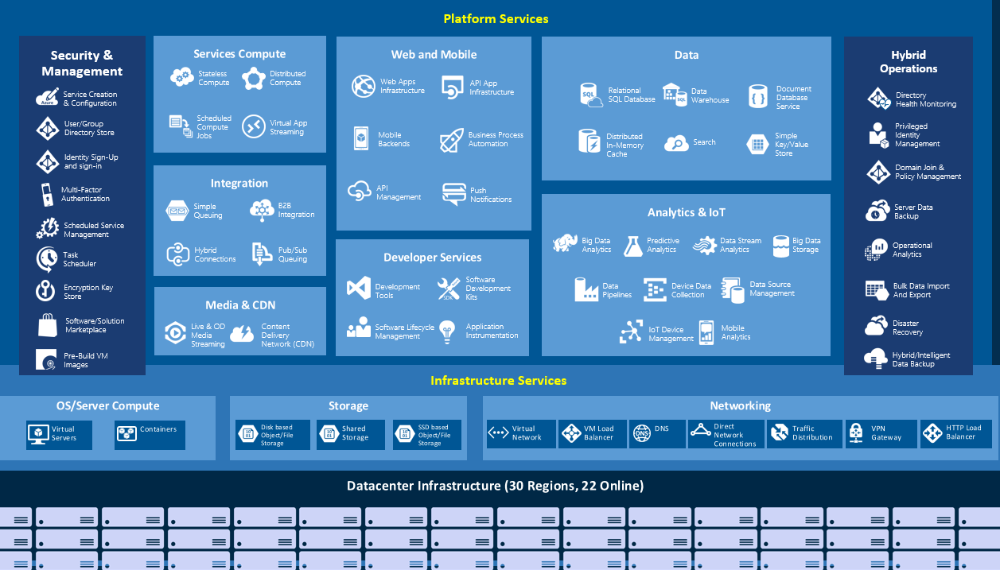

# Module: Azure 101 Presentation

# Abstract

This presentation provides an overview of Microsoft Azure. After this presentation you will understand the services Microsoft is providing as part of the Azure Cloud Platform. 

# Learning objectives
After completing the exercises in this module, you will be able to:
* Basic concepts of cloud computing
* Overview of the various Azure Services
* Deeper view of Azure Infrastructure services
* Walkthrough the Azure Portal

# Prerequisite 
None

# Estimated time to complete this module:
1 hour

# Azure 101

